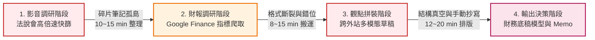
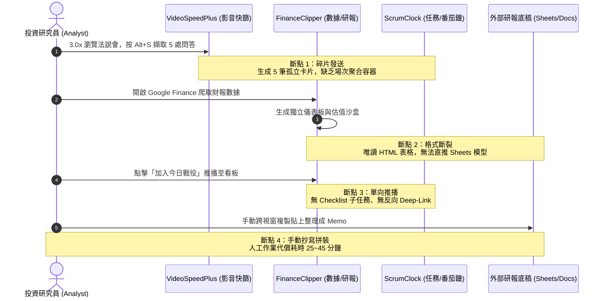
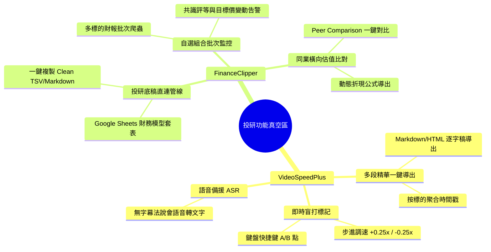

# 投資研究員 (Analyst) 投研工作流摩擦力診斷矩陣 (Analyst Workflow Friction Matrix)

> **文件狀態**：正式生效  
> **建立日期**：2026-10-03  
> **適用角色**：買方/賣方投資研究員 (Equity/Industry Analyst)、研究助理 (RA)、基金經理人 (Fund Manager)  
> **關聯插件**：`chrome_video speed plus` (法說會快篩與字幕筆記)、`finance-research-clipper-oss` (個股財務指標與研報爬蟲)、`chrome_scrumclock` (今日作戰任務池)  
> **關聯合約**：`0.doc_mg/docs/cross_plugin_contract.md`、`0.doc_mg/docs/google_ecosystem_integration_spec.md`

---

## 1. 執行摘要 (Executive Summary)

現代投資研究員 (Analyst) 在瀏覽器端進行個股與產業研究時，核心期望為建立「**法說會影音快篩 $\rightarrow$ 財報指標萃取 $\rightarrow$ 研報觀點拼裝 $\rightarrow$ 投資備忘錄與財務模型輸出**」的高效研發飛輪。  
然而經實測體檢，目前生態系中的 `chrome_video speed plus`、`finance-research-clipper-oss` 與 `chrome_scrumclock` 雖各自具備突出的單點功能，但在投研高頻深水區日常中，存在顯著的「**三大維度摩擦力（格式摩擦、拼裝摩擦、時效摩擦）**」與「**多模態資料孤島**」。  
單場法說會與單份個股財報調研的人工複製、轉檔、排版與比對代償耗時高達 **25~45 分鐘**，嚴重制約了高時效投資決策效率。



---

## 2. 投研工作流三大維度摩擦力深度診斷矩陣 (Three-Tier Friction Matrix)

### Tier 1: 格式摩擦力 (Format Friction) — 數據落地與表格搬運

| 斷點編號 | 摩擦力節點 | 觸發場景與痛點本質 | 現有代償行為 (Workaround) | 認知與時間耗損 | 嚴重度 |
| :--- | :--- | :--- | :--- | :--- | :--- |
| **FF-01** | **財務報表格式斷裂無法直落試算表** | FinanceClipper 獨立儀表板 (`dashboard.html`) 呈現損益表、資產負債表與分析師階梯，但僅為唯讀 HTML 表格，缺乏「一鍵複製為 Clean TSV/Markdown」或直推 Google Sheets。 | 研究員手動滑鼠拖曳反白 $\rightarrow$ 貼上 Excel/Sheets $\rightarrow$ 重新手動修復跑版、千分位逗號與負號格式。 | 單次個股拆表耗時 8~12 分鐘，極易發生資料錯行錯列。 | **Critical** |
| **FF-02** | **估值沙盒參數無法匯出動態模型公式** | 獨立儀表板的 5x5 敏感度估值矩陣為動態即時運算，但無法一鍵匯出為 Excel/Google Sheets 標準公式（如 `TABLE` 或動態折現公式）。 | 研究員僅能截圖貼入報告，或在 Excel 中手動重新建立折現率矩陣並手動輸入數值。 | 耗時 5~8 分鐘，底稿喪失動態可追溯性與可審計性。 | **High** |
| **FF-03** | **外站與 PDF 研報非結構化表格解析真空** | 分析師常需研讀各大券商 PDF 報告或外部財報站（公開資訊觀測站、富途牛牛、SEC EDGAR），現有 4合1 爬蟲僅綁定 Google Finance DOM。 | 遇到非 Google Finance 頁面時爬蟲失效，只能人工逐字打進模型或使用第三方 OCR。 | 單篇研報提取核心數據需手動抄寫 15~20 分鐘。 | **High** |
| **FF-04** | **圖表資產非結構化與離線丟失** | 研報爬蟲抓取的圖片雖支援壓縮暫存，但產能規劃線圖、產業鏈圖譜無法自動轉存至雲端 Drive 研報專屬目錄，亦未做 OCR 標籤化。 | 手動另存圖檔至本機資料夾，再上傳雲端硬碟手動重新命名歸檔。 | 研報撰寫時圖片散落，整理耗時 5 分鐘。 | **Medium** |

---

### Tier 2: 拼裝摩擦力 (Assembly / Aggregation Friction) — 多模態萃取與草稿整合

| 斷點編號 | 摩擦力節點 | 觸發場景與痛點本質 | 現有代償行為 (Workaround) | 認知與時間耗損 | 嚴重度 |
| :--- | :--- | :--- | :--- | :--- | :--- |
| **AF-01** | **影音字幕碎片化筆記孤島** | VideoSpeedPlus 按下 `Alt+S` 時，直接向 ScrumClock 發送獨立待辦卡片；一場 60 分鐘法說會標註 10 處 Q&A，會被切散為 10 張雜亂待辦。 | 研究員在 ScrumClock 看板上逐一複製 10 張卡片的文字，手動貼回 Google Docs 或 Notion 重新彙整。 | 嚴重打斷聽會節奏，會後手動彙整消耗 10~15 分鐘。 | **Critical** |
| **AF-02** | **多模態資訊缺乏統一結構化容器** | 一份標準投資備忘錄包含「法說會發言原話 (VideoSpeed)」、「財務比率與估值 (FinanceClipper)」、「文字研報邏輯」。現況下三者各自為政，無中介聚合容器。 | 同時開啟 4~6 個分頁與記事本，肉眼比對、反覆跨視窗切換貼上進行手動拼裝。 | 認知過載 (Cognitive Overload)，單篇初稿拼裝耗時 20~30 分鐘。 | **Critical** |
| **AF-03** | **單向拋轉缺乏雙向反查 Deep-Link** | 字幕卡片推送到 ScrumClock 後，僅帶單一靜態網址；當研究員想複聽前後 30 秒語境時，缺乏「點擊即於原分頁跳轉至時間戳並自動降速精聽」的雙向導航。 | 需重新打開 YouTube 分頁 $\rightarrow$ 手動拖曳進度條至特定秒數 $\rightarrow$ 手動調整倍速。 | 複查單一數據點需 1~2 分鐘，破壞研讀流暢感。 | **High** |
| **AF-04** | **無字幕法說會之語音萃取降級失敗** | 當法說會影片無內建字幕或即時字幕品質極差時，`Alt+S` 僅能抓取標題，缺乏自動調用語音轉文字 (ASR) 或匯入錄音檔之容錯管線。 | 研究員只能暫停播放，手動打字鍵入發言人重點，無法盲打跟上。 | 徹底喪失極速快篩優勢，耗時倍增。 | **High** |

---

### Tier 3: 時效摩擦力 (Timeliness Friction) — 日程追蹤與多標的監控

| 斷點編號 | 摩擦力節點 | 觸發場景與痛點本質 | 現有代償行為 (Workaround) | 認知與時間耗損 | 嚴重度 |
| :--- | :--- | :--- | :--- | :--- | :--- |
| **TF-01** | **法說會與財報行事曆真空** | 分析師需密切追蹤 20~40 檔核心自選股之法說會日程 (Earnings Calendar) 與揭露期限，插件缺乏日曆整合與事前自動提醒。 | 分析師手動在 Google Calendar 建立事件，或每天早上肉眼查閱券商每日晨訊。 | 經常遺漏重要冷門標的法說會，每日排程維護耗時 10 分鐘。 | **Critical** |
| **TF-02** | **單一標的束縛，缺乏自選組合批次監控** | FinanceClipper 一次僅能爬取當前瀏覽之單一股票，無法在背景對整個投資組合 (Watchlist) 進行批次爬取、共識評等變動與目標價階梯警報。 | 分析師需手動逐一打開 20 檔股票分頁，分別點擊爬取並切換儀表板檢視。 | 追蹤整個板塊或同業耗時 30 分鐘以上，無法應對盤中突發異動。 | **High** |
| **TF-03** | **投研作戰衝刺未與工作站情境綁定** | 當分析師準備對某標的進行 25 分鐘「專注法說研讀」時，需手動開影片、手動調速、手動至 ScrumClock 開番茄鐘，缺乏一鍵進入「標的專屬作戰環境」。 | 重複機械式開啟分頁與設定倒數，缺乏沉浸式投研情境引導。 | 情境暖身與切換摩擦，每次約耗時 2~3 分鐘。 | **Medium** |

---

## 3. 跨插件斷點深水區：三大插件協同架構診斷

在投資研究員的工作日常中，資訊流應呈「**影音多模態萃取 $\rightarrow$ 財務指標驗證 $\rightarrow$ 行動任務閉環**」的閉環。然而當前各插件實作存在嚴重語意脫節：



### 深層障礙根因分析
1. **容器顆粒度錯位 (Item vs Session)**：
   - `chrome_video speed plus` 發送的 `COLLECT_NOTE` 是以「單點時間戳」為單位。
   - 投研工作流需要的則是「標的調研會話 (Research Session: Ticker + Conference Date)」，必須能將多條時間戳筆記聚合在同一草稿物件下。
2. **通訊合約缺乏雙向握手 (One-way Push vs Bidirectional Link)**：
   - `finance-research-clipper-oss` 雖然實作了合約 v2 的 `CREATE_TASK`，但推播後即成放生狀態。
   - ScrumClock 卡片無法反向打開 FinanceClipper 指定標的之儀表板，也無法回寫調研進度。
3. **資料模型缺乏通用交換層 (Data Interchange Gap)**：
   - 缺乏將財務表格（三表、比率）、估值結果與逐字稿文字自動序列化為標準 Markdown / Google Sheets API Payload 的中間層資料格式。

---

## 4. 投研場景功能真空區盤點 (Vacuum Zones)

針對投資研究員極致效率需求，盤點出兩大插件的關鍵功能真空區：



### 1. VideoSpeedPlus 真空區
1. **多段精華彙整導出容器 (Transcript Aggregator)**：
   - 支援「同一場法說會連續標註模式」，在該影片下收集的所有重點，於面板一鍵彙整為結構化逐字稿摘要並導出。
2. **免喚出 Popup 之鍵盤盲打標記**：
   - 新增全域快捷鍵直接於播放中打點（如 `Alt+A` 設起點、`Alt+B` 設終點、`Alt+[` / `Alt+]` 連續步進調速）。
3. **無字幕法說會之語音辨識管線 (Audio-to-Text)**：
   - 當影片無字幕時，可介接 Web Speech API 或雲端輕量語音辨識服務進行文字化。

### 2. FinanceClipper 真空區
1. **投研底稿直連管線 (Direct-to-Sheets Pipeline)**：
   - 儀表板表格支援「一鍵複製 Clean TSV（保留負數與數值格式）」以及透過 Google Sheets API 直推財務底稿範本。
2. **自選投資組合批次爬蟲與異動監控 (Portfolio Watcher)**：
   - 支援上傳或設定 20 檔股票代碼，定時或一鍵在背景走訪更新財務指標與目標價。
3. **同業橫向對比與模型公式化 (Peer Benchmark & Formula Export)**：
   - 提供同業估值乘數（P/E, P/B, EV/EBITDA）一鍵橫向比對，估值沙盒支援導出完整 Excel 運算公式。

---

## 5. 改善演進路徑與架構建議 (Evolution Roadmap)

依據 **Impact vs Effort** 評估矩陣，建議分四階段推動架構演進：

```mermaid
quadrantChart
    title 投研工作流改進優先級 (Impact vs Effort)
    x-axis 低投入 (Low Effort) --> 高投入 (High Effort)
    y-axis 低影響 (Low Impact) --> 高影響 (High Impact)
    quadrant-1 策略性重大投資 (Strategic)
    quadrant-2 高價值快速見效 (Quick Wins)
    quadrant-3 次要低優先 (Low Priority)
    quadrant-4 複雜次要考量 (Consider Later)
    "Clean TSV / Markdown 複製": [0.18, 0.88]
    "鍵盤盲打標記與步進調速": [0.22, 0.78]
    "雙向反查 Deep-Link 串接": [0.35, 0.75]
    "同一影片筆記聚合容器": [0.45, 0.90]
    "Google Sheets 模型直推": [0.65, 0.92]
    "多標的自選股批次監控": [0.72, 0.82]
    "無字幕語音 ASR 轉文字": [0.85, 0.65]
```

### 優先度評估清單與權衡分析 (Impact vs Effort Matrix Table)

| 評估項目 | 所屬插件 / 模組 | 核心價值與業務影響 (Impact) | 技術難度與工時 (Effort) | 優先級 | 落地階段 |
| :--- | :--- | :--- | :--- | :--- | :--- |
| **Clean TSV / Markdown 一鍵複製** | FinanceClipper (報表/對比/估值) | **High**：徹底消除千分位逗號與負號錯位，直貼 Excel 零跑版 | **Low**：純字串清洗與剪貼簿操作（0.5 人天） | **P0** | 階段一 (已完成 ✅) |
| **鍵盤盲打標記與步進調速** | VideoSpeedPlus (Content Script) | **High**：全螢幕極速快篩免喚出彈窗，手感大幅提升 | **Low**：全域鍵盤監聽與 step 調速（0.5 人天） | **P0** | 階段一 (已完成 ✅) |
| **雙向反查 Deep-Link 串接** | 跨插件協約 / ScrumClock / VSP | **Medium-High**：點擊卡片直接跳轉秒數反查，消除查找摩擦 | **Low-Medium**：URL 攜帶秒數與 Tab 喚起（1 人天） | **P0** | 階段一 (已完成 ✅) |
| **同一影片/標的筆記聚合容器** | VideoSpeedPlus / ScrumClock | **High**：避免單場法說會 10+ 散落卡片，收斂為單一草稿箱 | **Medium**：草稿箱狀態維護與聚合格式化（2 人天） | **P1** | 階段二 (Core Enabler) |
| **調研任務 Checklist 子項目** | ScrumClock (Task Component) | **High**：投研任務標準化（三表比對、估值驗證清單化） | **Medium**：卡片支援 Checklist 陣列（1.5 人天） | **P1** | 階段二 (Core Enabler) |
| **Google Sheets 財務模型直套** | FinanceClipper / GAS Webhook | **Critical**：自動產出三表底稿與估值公式，投研完全體 | **Medium-High**：GAS 範本建立與 API 批次寫入（3 人天） | **P2** | 階段三 (Strategic) |
| **自選組合批次巡檢 (Portfolio)** | FinanceClipper (Background) | **High**：背景自動輪詢 20 檔標的並發出異動告警 | **High**：SPA 背景隊列調度與防風控（3~4 人天） | **P2** | 階段三 (Strategic) |
| **無字幕法說會語音轉文字 (ASR)** | VideoSpeedPlus / AI 模組 | **Medium**：解決冷門無字幕影片，提供備援文字 | **High**：Web Speech 或外部 API 連接成本（4 人天） | **P3** | 階段四 (Advanced) |

### 階段一：高價值快速見效 (P0 Quick Wins - 消除格式與盲打斷點) `[已完成 ✅]`
- **FinanceClipper**: 儀表板報表新增「複製為 TSV (適用 Excel/Sheets)」按鈕（涵蓋損益表、同業對比與估值沙盒），格式自動清理千分位與括號負號。
- **VideoSpeedPlus**: 實作全螢幕鍵盤快捷鍵（`Alt+[` / `Alt+]` 步進微調 0.25x；`Alt+M` 快速標記精華時間戳至本地書籤）。
- **通訊契約**: 跨插件卡片推播支援 `deepLinkUrl`（帶秒數與標的參數），支援在 ScrumClock 一鍵反向喚起原視窗。

### 階段二：結構化草稿容器聚合 (P1 - 消除拼裝摩擦力)
- **跨插件中介草稿容器**: 建立以 `Ticker + Date` 為鍵值的臨時調研草稿箱，`Alt+S` 擷取字幕時自動追加至當前標的草稿箱，而非散落發送獨立待辦。
- **ScrumClock 支援調研子清單 (Checklist)**：轉入戰役時自動產生「法說重點、三表比對、估值敏感度驗證」等標記子項目。

### 階段三：雲端生態系直推 (P2 - Google Workspace 深度整合)
- **落實 `google_ecosystem_integration_spec.md`**：
  - 財務比率一鍵直寫 Google Sheets 專業財務底稿範本。
  - 法說會逐字稿與研報精華一鍵產出 Google Docs 投資備忘錄 (Research Memo)。

### 階段四：自選股批次與進階 AI 語音 (P3 - 進階演進)
- **背景批次巡檢**: 自選股異動掃描與目標價變動通知。
- **語音備援辨識**: 整合 Web Speech 或外部 API 處理無字幕語音法說會。
