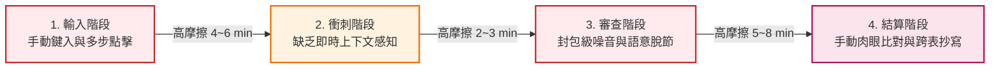
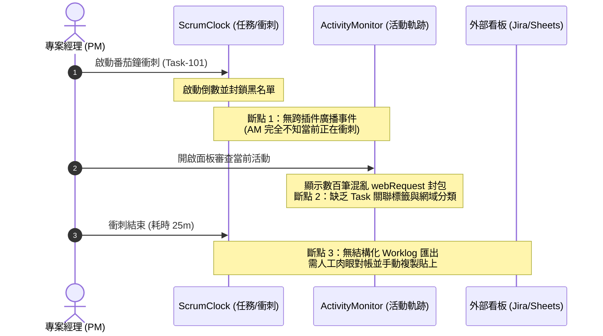

# 專案經理 (PM) 敏捷工作流摩擦力診斷矩陣 (PM Workflow Friction Matrix)

> **文件狀態**：正式生效  
> **建立日期**：2026-10-03  
> **適用角色**：專案經理 (PM)、技術組長 (Tech Lead)、敏捷教練 (Scrum Master)  
> **關聯插件**：`chrome_scrumclock` (任務與衝刺)、`browser-activity-monitor` (活動與資源軌跡)  
> **關聯合約**：`0.doc_mg/docs/cross_plugin_contract.md`

---

## 1. 執行摘要 (Executive Summary)

現代技術專案經理 (PM) 在瀏覽器端進行敏捷管理時，核心期望為建立「**排程規劃 $\rightarrow$ 專注衝刺 $\rightarrow$ 軌跡審查 $\rightarrow$ 工時結算**」的無縫飛輪。  
然而經實測體檢，目前 `chrome_scrumclock` 與 `browser-activity-monitor` 雖各自具備獨立的優異功能，但在 PM 高頻日常作業中存在嚴重的「**三級摩擦力（輸入、同步、匯出）**」與「**跨插件語意斷層**」。單次衝刺週期的人工補償操作耗時達 **8~15 分鐘**，嚴重削弱了工具的敏捷生產力價值。



---

## 2. 三級摩擦力深度診斷矩陣 (Three-Tier Friction Matrix)

### Tier 1: 輸入摩擦力 (Input Friction) — 任務排程與上下文捕獲

| 斷點編號 | 摩擦力節點 | 觸發場景與痛點本質 | 現有代償行為 (Workaround) | 認知與時間耗損 | 嚴重度 |
| :--- | :--- | :--- | :--- | :--- | :--- |
| **IF-01** | **缺乏外部快速捕獲機制 (Quick Capture)** | PM 在 GitHub PR、Jira、Slack、Google Docs 看到待辦時，無法右鍵選取文字或快捷鍵一鍵捕獲為 ScrumClock 任務。 | 需切換分頁 $\rightarrow$ 點擊插件圖示 $\rightarrow$ 手動複製貼上標題與連結。 | 每次跨分頁切換需 15~30 秒，打斷當前思路。 | **High** |
| **IF-02** | **任務資料模型扁平化** | `WeeklyMission` 僅支援單層扁平結構，缺乏 `Epic $\rightarrow$ Story $\rightarrow$ Subtask` 的樹狀階層與摺疊關聯。 | 在任務標題前綴手動加註 `[Epic-1]` 或 `[Sub]`，看板視覺混亂。 | 專案規模擴大時看板難以辨識，組織成本倍增。 | **High** |
| **IF-03** | **關鍵屬性輸入介面缺失** | 資料結構已具備 `estimatedPomodoros` 與 `priority`，但 `TaskDetailDrawer` 抽屜面板**缺少預估工時輸入元件**，且優先級缺乏 `P0 (Blocker)`。 | 預估工時只能靠記憶或寫在備註文字；緊急阻斷任務只能標記為普通 P1。 | 敏捷工時容量預算 (Capacity Planning) 失效。 | **Medium** |
| **IF-04** | **AI 拆解任務缺乏原子收納** | Gemini 拆解後的行動子任務「批量轉入任務池」時，以獨立平鋪任務寫入，與父任務脫鉤。 | 需手動逐一修正標題，避免在未完成池中混雜迷航。 | 每次拆解後需耗費 1~2 分鐘重新整理池內清單。 | **Medium** |

---

### Tier 2: 同步摩擦力 (Sync Friction) — 行事曆排程與情境切換

| 斷點編號 | 摩擦力節點 | 觸發場景與痛點本質 | 現有代償行為 (Workaround) | 認知與時間耗損 | 嚴重度 |
| :--- | :--- | :--- | :--- | :--- | :--- |
| **SF-01** | **外部行事曆單向排程阻力** | 目前僅支援將番茄鐘作為 Busy Event 寫入 Google Calendar，**缺乏 Google Tasks / Calendar 雙向即時排程**。當外部會議改期時無法聯動。 | PM 需開啟 Google Calendar 查看空檔，再回 ScrumClock 點擊衝刺。 | 衝刺極易與突發會議衝突，導致被迫中斷。 | **Critical** |
| **SF-02** | **衝刺中斷指標與原因真空** | 番茄鐘暫停 (`pauseSprint`) 僅解除 DeclarativeNetRequest 封鎖，**未記錄中斷次數 (Interruption Count) 與中斷原因** (如：突發線上會議、緊急 Slack 回應)。 | 專注被打破後無數據記錄，衝刺數據失真。 | 無法產出團隊敏捷專注品質指標 (Focus Quality KPI)。 | **High** |
| **SF-03** | **跨插件衝刺狀態脫鉤** | ScrumClock 啟動番茄鐘時，ActivityMonitor **完全不知情**（處於獨立黑盒狀態），無法自動標記「衝刺開始/結束標記點」。 | PM 需手動記住衝刺起訖時間戳（如 14:00~14:25）。 | 需同時手動操作兩款插件，違背自動化初衷。 | **High** |

---

### Tier 3: 匯出與結算摩擦力 (Export & Settlement Friction) — 審查與工時對帳

| 斷點編號 | 摩擦力節點 | 觸發場景與痛點本質 | 現有代償行為 (Workaround) | 認知與時間耗損 | 嚴重度 |
| :--- | :--- | :--- | :--- | :--- | :--- |
| **EF-01** | **底層封包噪音 vs 語意化停留時長** | ActivityMonitor 追蹤的是 `webRequest` 網路封包與資源請求，而非分頁啟用停留時長 (`tabs.onActivated`)；無「工作 vs 娛樂」網域分類。 | PM 面對上千筆 JS/CSS/CDN 請求記錄，無法一眼看出在特定工作網頁停留多久。 | 人工辨識網域認知過載，單次回溯耗時 3~5 分鐘。 | **Critical** |
| **EF-02** | **工時結算需手動肉眼比對** | `ActivityLog` (IndexedDB) 與 ScrumClock 的 `sprintLogs` 缺乏 `missionId` 關聯外鍵，無法一鍵產出「本任務關聯的分頁軌跡」。 | PM 一邊開 ScrumClock 看卡片，一邊開 ActivityMonitor 搜尋網址手動核對。 | 每日工時結算需花費 10~15 分鐘，極易放棄記錄。 | **Critical** |
| **EF-03** | **缺乏結構化拋轉介面 (Jira/Sheets)** | 結算完成後，無法一鍵將「任務名稱 + 消耗番茄鐘 + 精確耗時 + 參考網址」結構化拋轉至 Google Sheets 或 Jira Worklog。 | 手動複製文字逐一貼到專案管理外部系統。 | 每次跨系統報工需重複機械複製貼上。 | **High** |

---

## 3. 跨插件斷點深水區：ScrumClock 與 ActivityMonitor 協同障礙

在 PM 的視角中，排程與審查是一體兩面：**「計劃做什麼 (ScrumClock)」** 應該能夠印證 **「實際做了什麼 (ActivityMonitor)」**。然而當前兩者的協同存在以下深層障礙：



1. **資料黑盒與儲存孤島**：
   - ScrumClock 使用 `chrome.storage.local`，ActivityMonitor 使用 `IndexedDB`。
   - 雙方無直接資料交換管線，亦未依照 `cross_plugin_contract.md` 建立 `SPRINT_SESSION_EVENT` 廣播協議。
2. **語意落差 (Packet-level vs Task-level)**：
   - ActivityMonitor 面向「安全性與封包診斷」，而 PM 需求為「分頁專注度與專案網域歸屬」。
   - 高頻串流更新造成視覺干擾，未能為 PM 提供「低頻、高語意、聚焦任務」的專注簡報。

---

## 4. 改善演進路徑與架構建議 (Evolution Roadmap)

針對上述三級摩擦力，建議後續版本依循以下優先度推進改造：

### 階段一：跨插件衝刺通訊契約落實 (P0 - Quick Win)
- **實作 `cross_plugin_contract.md` 事件**：
  - ScrumClock 衝刺啟動時，發布 `EVENT_SPRINT_START { missionId, title, duration }`。
  - ActivityMonitor 接收廣播，自動於日誌打上衝刺會話標記 (`sprintSessionId`)，並切換至「專注審查模式」（過濾靜態資源，僅保留頂層導航）。

### 階段二：輸入與分層體驗強化 (P1)
- **ScrumClock 敏捷層級補齊**：
  - 任務資料結構擴充 `parentId`、`level: 'epic' | 'story' | 'task'`。
  - `TaskDetailDrawer` 補齊預估工時 (`estimatedPomodoros`) 與 `P0 (Blocker)` 標籤選擇器。
- **快速捕獲 Context Menu**：
  - 支援瀏覽器選取文字後右鍵：「加入 ScrumClock 任務」。

### 階段三：雙向排程與結構化匯出 (P2)
- **Google Calendar / Tasks 雙向聯動**：
  - 支援從 Google Tasks 讀取今日待辦，雙向同步完成狀態。
- **結構化工時拋轉 (Worklog Export)**：
  - 提供衝刺結束「一鍵複製為 Markdown / CSV / Jira 格式」按鈕。

---

## 5. PM 場景功能真空區深度盤點 (Feature Void Analysis)

在 PM 敏捷研發管理與工時審查全生命週期中，現有模組在特定關鍵環節存在「功能真空」，即使用現有按鈕或功能亦無法達成業務目的，必須依賴外部試算表或人工記錄補償：

### 5.1 ScrumClock 功能真空區

| 真空編號 | 功能模組缺失 | PM 場景業務衝擊 | 現狀代償方案 | 技術挑戰與相依 |
| :--- | :--- | :--- | :--- | :--- |
| **SC-V01** | **甘特圖 / 時序依賴視圖 (Gantt & Timeline View)** | 看板僅能呈現當前狀態，無法視覺化 Epic/Story 的前後相依性 (Dependencies) 與關鍵路徑 (Critical Path)。 | 需額外維護 Jira Timeline、Notion 或 Monday.com，導致狀態不同步。 | 需基於任務起訖時間與父子關係渲染 SVG/Canvas 時間軸。 |
| **SC-V02** | **自動化週/月報日誌匯出 (Automated Sprint Digest)** | 無法一鍵彙整當週「已完成任務清單、耗損番茄鐘、衝刺達成率、中斷率統計」，需手動翻查卡片記錄。 | 每週五下午 PM 需花費 30~45 分鐘手工複製任務標題並統計工時產出週報。 | 需聚合 `chrome.storage.local` 歷史 `sprintLogs` 並格式化為 Markdown/HTML。 |
| **SC-V03** | **行事曆衝突預警與智慧時間箱 (Calendar Conflict Alert)** | 點擊啟動衝刺時，若接下來 25~50 分鐘內已有 Google Calendar 會議，系統不會主動預警攔截，極易造成衝刺被迫腰斬。 | 每次衝刺前 PM 必須手動切換至 Google 日曆分頁查看接下來是否有會。 | 需調用 Chrome Calendar API 或預讀 OAuth 快取的近端 Event 清單比對時間重疊。 |
| **SC-V04** | **團隊容量與燃盡速率面板 (Team Capacity & Velocity)** | 缺乏對 PM 自身或團隊當週可用總工時預算 (Capacity Hours) 與每日燃盡圖 (Burndown Chart) 的量化追蹤。 | 無法在衝刺中期預警工時超支或落後，需靠人工直覺評估。 | 需建立 Sprint 週期的總容量設定並每日快照剩餘點數/番茄數。 |

### 5.2 ActivityMonitor 功能真空區

| 真空編號 | 功能模組缺失 | PM 場景業務衝擊 | 現狀代償方案 | 技術挑戰與相依 |
| :--- | :--- | :--- | :--- | :--- |
| **AM-V01** | **工作 vs 休閒域名智慧分類 (Smart Domain Categorization)** | 僅有技術封包資訊，無預設或自訂之「生產力 (GitHub/Figma/Jira) vs 通訊 (Slack/Gmail) vs 分心 (YouTube/Social)」網域標籤庫。 | 審查日誌時必須逐條肉眼審核 URL 網域，耗損極大認知頻寬。 | 需內建輕量分類規則字典，並支援使用者自訂網域標籤覆寫。 |
| **AM-V02** | **專注度分數與分心指標演算法 (Focus Score Algorithm)** | 缺乏綜合「分頁切換頻率 (Switch Velocity)」、「休閒網站停留佔比」、「背景非工作請求量」的量化專注指數 (0~100 分)。 | PM 審查時無客觀指標可供快速定性，只能憑印象判斷工作效率。 | 需設計加權評分公式：$\text{Score} = f(\text{工作網域佔比}, \text{切換頻率}, \text{衝刺時間箱})$。 |
| **AM-V03** | **衝刺關聯分頁快照 (Sprint Activity Reel)** | 衝刺結束時未將當次時段內所訪問的關聯工作分頁自動聚合為一組「任務參考證據鏈」。 | 日後回溯某任務參考了哪些技術文檔時，必須去瀏覽器通用歷史紀錄翻找。 | 需監聽衝刺起訖事件，於記憶體聚合同一時段內的導航頂層網址。 |
| **AM-V04** | **隱私去敏與報告拋轉 (Privacy-Preserving Sanitization)** | 若欲將活動軌跡匯出作為客戶工時驗收或主管審查憑證，缺少一鍵遮蔽內部 Token、私有參數位址的功能。 | 完全無法直接導出給外部查看，工時透明化受阻。 | 需在匯出管線加入正規化遮蔽 (Query Parameter & Private IP Sanitization)。 |

---

## 6. Impact vs Effort 優先度評估矩陣 (Impact vs Effort Matrix)

本評估綜合考量 **PM 業務價值與痛點緩解程度 (Impact)** 以及 **架構與開發複雜度 (Effort)**，將上述 8 大斷點與 8 大真空區進行象限劃分，作為跨插件迭代實施之 SSOT 依據：

```mermaid
quadrantChart
    title PM 敏捷工作流功能優先度象限 (Impact vs Effort)
    x-axis 低開發成本 (Low Effort) --> 高開發成本 (High Effort)
    y-axis 低業務影響 (Low Impact) --> 高業務影響 (High Impact)
    quadrant-1 策略專案 (Major Projects) - P1
    quadrant-2 優先速贏 (Quick Wins) - P0
    quadrant-3 次要待辦 (Fill-ins) - P2
    quadrant-4 暫緩考慮 (Deprioritize) - P3
    "IF-01 外部右鍵快速捕獲": [0.25, 0.85]
    "IF-03 預估工時與 P0 屬性": [0.18, 0.72]
    "SF-02 衝刺中斷指標與原因": [0.22, 0.78]
    "SC-V03 行事曆衝突即時預警": [0.35, 0.82]
    "AM-V01 工作/休閒域名分類庫": [0.40, 0.88]
    "SC-V02 自動化週報日誌匯出": [0.30, 0.75]
    "EF-03 結構化 Worklog 匯出": [0.28, 0.80]
    "SF-03 跨插件衝刺通訊契約": [0.38, 0.90]
    "IF-02 敏捷樹狀階層模型": [0.70, 0.85]
    "SF-01 日曆雙向即時排程": [0.82, 0.92]
    "EF-01 語意化分頁停留時長": [0.65, 0.88]
    "EF-02 工時自動化跨庫對齊": [0.75, 0.90]
    "AM-V02 專注度綜合評分模型": [0.55, 0.72]
    "SC-V01 敏捷甘特圖視角": [0.85, 0.65]
    "SC-V04 團隊燃盡圖與容量": [0.78, 0.58]
    "AM-V04 隱私去敏與報告拋轉": [0.45, 0.48]
```

### 6.1 優先級詳細清單與落地建議

| 優先度等級 | 項目編號 | 項目名稱 | 影響力 (Impact) | 成本 (Effort) | 關鍵實作策略與建議落地方式 |
| :--- | :--- | :--- | :--- | :--- | :--- |
| **P0: Quick Wins<br/>(速贏項目)** | **IF-01** | 外部選取文字右鍵快速捕獲 | **High** | **Low** (1~2d) | 於 `background.js` 新增 `chrome.contextMenus`，點擊即寫入 `chrome.storage.local` 待辦池。 |
| | **IF-03** | 抽屜預估工時輸入與 P0 標籤 | **Medium-High** | **Low** (1d) | 修改 `TaskDetailDrawer.tsx` 補齊 NumberStepper 與優先級 Radio Group。 |
| | **SF-02** | 衝刺中斷記錄與原因收集 | **High** | **Low** (1~2d) | `pauseSprint` 時彈出簡易打擾原因快速選擇 (會議 / 緊急插單 / 個人休整)。 |
| | **SC-V03** | 行事曆衝突攔截預警 | **High** | **Low-Medium** (2d) | 啟動倒數前比對近 1 小時行程，遇重疊彈出「發現會議衝突，是否縮短為 15 分鐘？」建議。 |
| | **AM-V01** | 工作 vs 休閒域名內建分類 | **High** | **Medium** (2~3d) | 內建常見 100+ 開發/辦公與社群網域映射字典，日誌呈現色彩標籤與過濾切換鈕。 |
| | **SC-V02** | 一鍵自動化週報日誌匯出 | **High** | **Low-Medium** (2d) | 依週別聚合 `sprintLogs`，提供「複製週報 Markdown」按鈕，格式化呈現亮點。 |
| | **EF-03** | 結構化工時拋轉 (Jira/CSV) | **High** | **Low-Medium** (2d) | 提供單次/批量衝刺記錄導出為標準 CSV / Jira Worklog 格式。 |
| | **SF-03** | 跨插件衝刺通訊契約落實 | **Critical** | **Medium** (2~3d) | 落實 `cross_plugin_contract.md` 定義之 `SPRINT_SESSION_EVENT` 外部通訊。 |
| **P1: Major Projects<br/>(策略核心)** | **IF-02** | 任務模型支援 Epic/Story/Task | **High** | **High** (4~6d) | 重構 `WeeklyMission` 類型，新增階層樹狀渲染與看板泳道分組。 |
| | **EF-01** | 語意化分頁停留時長追蹤 | **High** | **Medium-High** (3~5d) | 擴充 `tabs.onActivated` 與休眠計時器，產出以分頁網域為單位的聚合停留時間。 |
| | **EF-02** | 工時自動對齊與任務外鍵 | **Critical** | **High** (4~5d) | 透過通訊廣播將 `missionId` 注入活動追蹤，實現一鍵自動歸戶結算。 |
| | **SF-01** | Google Calendar 雙向排程 | **Critical** | **High** (5~7d) | 整合 Google Tasks / Calendar API 雙向同步拉取與狀態回寫。 |
| | **AM-V02** | 專注度分數與動態指數 | **Medium-High** | **Medium** (3d) | 定義專注演算法並於 Side Panel 渲染當日專注儀表板。 |
| **P2: Fill-ins<br/>(增值迭代)** | **AM-V04** | 隱私去敏遮蔽過濾器 | **Medium** | **Low-Medium** (2d) | 於日誌匯出與預覽層加入正規化脫敏管線。 |
| | **SC-V01** | 敏捷甘特圖與時序依賴 | **Medium** | **High** (6~8d) | 評估整合輕量 SVG Timeline 元件，適合專案規模擴大時引入。 |
| | **SC-V04** | 團隊燃盡圖與容量儀表 | **Medium** | **High** (5~6d) | 支援週容量上限警示與工時消耗燃盡折線圖。 |

