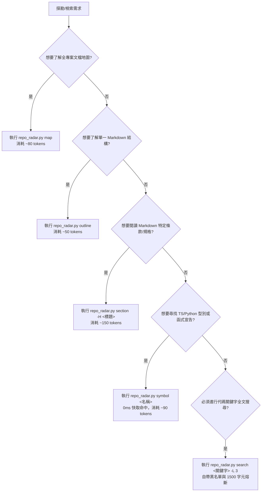

# Repo Radar AI 導航與精準檢索指引 (repo_radar_ai_prompt_instructions.md)

> [!IMPORTANT]
> **SSOT 業務規格指引**：本指引定義 AI 代理在 Chrome Plus Monorepo 專案中進行探勘、檢索與閱讀程式碼/文檔時之標準決策樹與命令規範。所有探勘行為必須以「極低 Token 消耗」與「零 Context 污染」為最高原則。

---

## 1. 核心哲學：防範 Token 黑洞的四原則

1. **大綱先行 (Outline First)**：禁止直接全文閱讀超過 100 行的 Markdown 或代碼檔，先獲取結構樹與行號錨點。
2. **章節切片 (Chunk by Section)**：只提取目標段落內容，嚴禁整檔 Dump 到對話上下文。
3. **符號定位 (Symbol Locator)**：查詢介面 (interface)、型別 (type)、類別 (class) 或函式簽名時，優先使用符號索引秒查。
4. **預算熔斷 (Token Budget Hard Limit)**：全文字串搜尋強制套用黑名單過濾與 1,500 字元長度限制。

---

## 2. AI 檢索決策樹 (Decision Tree)

當你需要獲取專案資訊時，請依據以下情境選擇最佳路徑：



---

## 3. CLI 指令標準手冊

所有工具位於 `1.devtools/tools/`，專案根目錄執行語法如下：

### 3.1 專案全貌地圖 (`map`)
* **使用時機**：開啟新工作、跨插件協調、或不確定某項業務規範寫在哪份文檔時。
* **指令**：
  ```bash
  python 1.devtools/tools/repo_radar.py map
  ```
* **預算效益**：僅返回各文件之 H1 與 H2 標題層級，耗費約 80 Tokens（傳統全文掃描需 10,000+ Tokens，節省率 99%）。

### 3.2 文檔大綱透視 (`outline`)
* **使用時機**：面對超過 100 行之規範文檔、任務檔或規格書，需鎖定行號範圍。
* **指令**：
  ```bash
  python 1.devtools/tools/repo_radar.py outline 0.doc_mg/docs/cross_plugin_contract.md
  ```
* **預算效益**：快速列出標題階層、所在行號與該區段預估 Token，耗費約 50 Tokens。

### 3.3 精準章節切片 (`section`)
* **使用時機**：已由大綱鎖定標題，需讀取特定規範章節內容（如「3.1 廣播發文契約」）。
* **指令**：
  ```bash
  python 1.devtools/tools/repo_radar.py section 0.doc_mg/docs/cross_plugin_contract.md --heading "3.1"
  ```
* **預算效益**：自動切片至下一個同級/高級標題前截斷，精準提取 100~200 Tokens。

### 3.4 符號秒級定位 (`symbol`)
* **使用時機**：需確認 TypeScript Props 介面、資料型別、類別定義或 Python 函式簽名。
* **指令**：
  ```bash
  python 1.devtools/tools/repo_radar.py symbol TaskTriageProposal
  python 1.devtools/tools/repo_radar.py symbol BoardViewProps
  ```
* **預算效益**：優先自 `.repo_index.json` 秒級獲取定義區塊（前 18 行），耗費約 90 Tokens，避免讀取千行組件實作。

### 3.5 帶熔斷關鍵字搜尋 (`search`)
* **使用時機**：不確定符號名稱，需跨專案排查常數名稱或函式呼叫點。
* **指令**：
  ```bash
  python 1.devtools/tools/repo_radar.py search "EXECUTE_ROUTER_ACTION" --limit 3
  ```
* **防護機制**：自動排除 `node_modules`、`dist`、`build`、`.git`、`archive` 等目錄，單筆結果截斷並熔斷於 1,500 字元上限。

### 3.6 符號與結構索引更新 (`generate_symbol_index.py`)
* **使用時機**：專案新增/刪除型別定義或重構文檔後，手動更新全域快取。
* **指令**：
  ```bash
  python 1.devtools/tools/generate_symbol_index.py
  ```
* **快取產物**：`.repo_index.json`（已加入 `.gitignore`，不污染版本控制）。

---

## 4. 禁忌與違規處罰條款

1. 🚫 **嚴禁未探勘全檔 Dump**：禁止對未知長度或超過 100 行之代碼/文檔直接呼叫無行號限制的讀取工具。
2. 🚫 **嚴禁跨插件窺探**：使用 `symbol` 或 `search` 獲取結果時，若涉及其他非本任務鎖定之插件目錄，嚴禁進一步讀取其實作細節（嚴守黑盒隔離）。
3. 🚫 **嚴禁將快取提交至 Git**：`.repo_index.json` 為純本地快取，嚴禁移除 `.gitignore` 規則。
