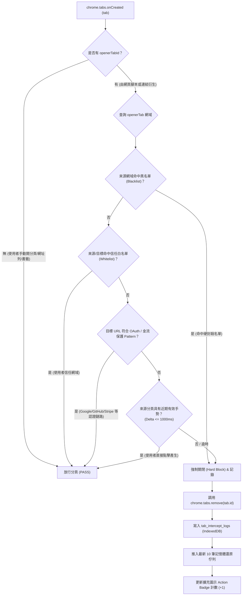

# 🛡️ Browser Activity Monitor - 雙軌隨選健檢架構與原生授權審查 (SSOT)

> [!IMPORTANT]
> **AI 開發專用導航指引 (SSOT)**：
> 本文檔為 `browser-activity-monitor` 之**單一真實來源說明與架構手冊 (SSOT)**。
> 本插件遵循 Chrome Extension Manifest V3 規範，徹底消除觀察者效應，採用「常態零耗能待命 + 雙軌隨選健檢」架構。
> 所有 Markdown 連結與檔案參照一律相對於當前檔案或工作區相對路徑，嚴格禁止本機絕對路徑。

---

## 🌟 核心功能亮點 (Key Features)

- ⚡ **徹底消除觀察者效應 (Zero Standby Overhead)**：
  - 平時 Service Worker 深度待命，完全不掛載 `webRequest` 網路攔截器、不進行背景磁碟寫入，日常瀏覽 0% 額外開銷。
- ⏳ **語意化活躍停留時長統計 (AM-01 Tab Time Tracker)**：
  - 常態零負載監聽前台分頁焦點 (`chrome.tabs.onActivated`、`chrome.windows.onFocusChanged`)，秒級累計有效工作時長，排除背景分頁虛報。
- 🏷️ **網域智慧分類標籤與聚合看板 (AM-02 Domain Classifier)**：
  - 擴充現代 PM 工具（Notion、Jira、Docs、Linear）、通訊（Slack、Teams）與娛樂（YouTube、Netflix）網域分類字典，側邊欄彩色 Badge 標示與一鍵類別過濾。
- 🔒 **日誌隱私脫敏匯出與遮蔽開關 (AM-03 Privacy Sanitizer)**：
  - 前端純化管線，在匯出 JSON 或複製日誌時，自動遮蔽機密 Query 參數（`token`、`auth`、`key`、`secret`、`password`、`session` 等）與內部私有 IP（`10.x`、`192.168.x`、`172.16-31.x`、`localhost`）。
  - 側邊欄提供「🔒 脫敏」切換開關，脫敏僅在匯出/複製管道生效，100% 不污染底層 IndexedDB 原始除錯數據。
- 🚫 **自動跳窗與惡意分頁攔截 (AM-04 Popup & Tab Trap Interceptor)**：
  - 常態零待命監聽分頁創建事件（`chrome.tabs.onCreated`），結合來源分頁識別 (`openerTabId`) 與暫態手勢時限比對，精準鑑別並自動攔截未經使用者手勢授權之非同步彈窗（Tab Trap）。
  - **強效網域黑名單（Domain Blacklist / Hard Blocklist）**：支援使用者自訂黑名單網域，一旦命中黑名單來源，全面強制關閉該網域下所有跳出分頁（無視手勢，全面靜音封殺）。
  - **白名單與關鍵鏈路豁免保護**：預設信任直接使用者手勢，並對常見 OAuth 認證跳轉（Google、GitHub、Apple 等）及金流閘道（Stripe、PayPal 等）提供自動放行豁免，杜絕誤殺。
  - **透明復原與安全回饋**：提供 Action Badge 即時攔截計數、側邊欄攔截佇列追蹤與一鍵還原分頁（Undo Restore），完全掌握網頁彈窗行為。
- ⏱️ **雙軌隨選健檢機制 (Dual Profiling Modes)**：
  - **快速定時健檢 (Quick Audit - 60s)**：一鍵開啟 60 秒採樣，時間倒數結束自動結算並卸載監聽。
  - **持續檢測記錄模式 (Continuous Session Mode)**：手動開啟開始追蹤，手動停止、面板關閉或瀏覽器休眠時即刻自動結算並產生結構化「階段檢測報告卡」。
- 📋 **Session 彙總分析引擎與結構化報告 (Profiler Engine)**：
  - 記憶體輕量統計 TOP 耗能分頁/來源網域、高頻遙測比率與串流流量，自動產出可操作優化建議（如關閉高頻背景分頁）。
  - 儲存層升級：拔除單筆高頻寫入，改由 Session 結算時寫入 1 筆結構化報告至 `health_reports` 集合。
- 🫧 **前端 DOM 節點防護與環形緩衝區 (Ring Buffer)**：
  - 即時日誌串流嚴格維持最新 30 筆上限，DOM 節點總量恆定低於 100，根除前端節點過多警告。
- 🔬 **隨選動態深入探針 (On-Demand Deep Inspector)**：
  - 使用者點擊時透過 `chrome.scripting.executeScript` 注入雙層探針：
    - **MAIN 探針** (`scripts/probe-main.js`)：掛鉤 `getUserMedia`、`getCurrentPosition`、`readText` 原生 API，捕獲調用參數與 Callstack。
    - **ISOLATED 探針** (`scripts/probe-isolated.js`)：作為中繼防禦層，驗證 `__PROBE_MAIN__` 訊息並轉發至 Background。
  - 網頁重整或分頁關閉後探針自動失效。
- 🛡️ **原生網站權限審查**：
  - 調用 `chrome.contentSettings`，即時審查當前 Origin 之相機、麥克風、地理定位、通知與剪貼簿原生物理設定。
- 📈 **組件資源監視器與效能診斷 (Resource Profiler)**：
  - 內建微秒級耗時採集核心，實時統計 DOM 節點、JS Heap 記憶體、佇列積壓與平均延遲，面板收合時 0% 輪詢開銷。

---

## 🧭 專案檔案架構速查 (Architecture & File Map)

| 檔案相對路徑 | 類型 / 職責 | 關鍵技術實作 |
| :--- | :--- | :--- |
| `manifest.json` | **擴充功能配置宣告** | Manifest V3 規範、`sidePanel`、`alarms`、`contentSettings`、`webRequest`、`downloads` 宣告 |
| `background.js` | **背景服務核心 (Service Worker)** | 隨選動態掛載/卸載 `webRequest`、Session 生命週期狀態機、Port 廣播與組件協同 |
| `scripts/tab-time-tracker.js` | **前台分頁焦點時長追蹤器 (AM-01)** | 監聽 `tabs.onActivated`、`windows.onFocusChanged`，秒級計算前台有效停留時長並結算寫入 |
| `scripts/domain-classifier.js` | **網域智慧分類與統計聚合引擎** | PM 生產力 / 辦公通訊 / 休閒娛樂網域字典、`calculateCategoryStats` 分類時長統計 |
| `scripts/privacy-sanitizer.js` | **前端日誌隱私脫敏模組 (AM-03)** | 機密 Query 參數遮罩、私有 IP 辨識純化、日誌與時長批次脫敏函式 |
| `scripts/tab-interceptor.js` | **自動彈窗與惡意分頁攔截核心 (AM-04)** | 監聽 `tabs.onCreated` / `onUpdated`、黑名單引擎、規則 CRUD 與儲存同步 |
| `scripts/interceptor-content.js` | **Content Script 攔截中繼層 (AM-04)** | ISOLATED 世界，規則雙向同步、Capture 階段攔截 `target="_blank"` 點擊 |
| `scripts/interceptor-main.js` | **MAIN World 原生攔截探針 (AM-04)** | MAIN 世界，`document_start` 覆寫原生 `window.open` 阻斷惡意彈窗 |
| `scripts/session-profiler.js` | **Session 彙總分析引擎** | 記憶體輕量統計器 (`ProfilerSession`)、Noise Gate、TOP 分頁分析與優化建議生成 |
| `scripts/resource-profiler.js` | **組件資源監視與效能診斷核心** | 輕量耗時統計 (`ResourceProfiler`)、記憶體/佇列/DOM 診斷、智慧優化建議引擎 |
| `scripts/probe-main.js` | **MAIN 世界原生探針 (Dynamic Injected)** | 原生 API 掛鉤 (Monkey Patch)、`window.postMessage` 安全事件發佈 |
| `scripts/probe-isolated.js` | **ISOLATED 世界中繼探針 (Dynamic Injected)** | 驗證 `__PROBE_MAIN__` 來源與事件有效性、`chrome.runtime.sendMessage` 安全轉發 |
| `scripts/storage-db.js` | **IndexedDB 審計儲存層 (Storage Module)** | `AuditStorageDB` 類別、`health_reports`、`time_spent_logs` 儲存集合與聚合查詢 |
| `sidepanel/sidepanel.html` | **側邊監控視圖 UI (HTML)** | 停留時長總覽看板、分類進度條、TOP 5 活躍分頁、雙軌控制卡片、環形串流容器、脫敏開關、管理頁面捷徑 |
| `sidepanel/sidepanel.css` | **現代深色毛玻璃樣式 (CSS)** | 科技深色主題、彩色分類 Badge、多色停留時間進度條、30筆環形緩衝流、脫敏切換膠囊 |
| `sidepanel/sidepanel.js` | **側邊欄控制器邏輯 (Module)** | 停留時長看板即時更新、網域分類過濾、雙軌生命週期控制、環形緩衝區 (30筆)、脫敏匯出、開啟管理頁面 |
| `management/index.html` | **管理控制台主視圖 (Options Page)** | 獨立新分頁管理中心、總覽儀表板 (Dashboard) 視圖、分頁黑名單攔截視圖、指標統計卡片、規則表格、CRUD 與匯入彈窗 |
| `management/css/style.css` | **管理控制台設計系統 (CSS)** | 現代深色科技主題、Glassmorphism 卡片、多視圖切換面板、堆疊進度條、圖例四宮格、排行列表、自適應響應排版 |
| `management/js/main.js` | **管理中心入口腳本 (Module)** | 頁面初始化、多視圖面板導航切換 (Hash 路由支援)、全域 Toast 通知系統 |
| `management/js/dashboard.js` | **總覽儀表板核心模組 (Module)** | 有效停留時長與分類時長計算、專注度得分、多色進度條與圖例、即時活躍分頁秒數更新、Top 5 網站排行榜與報表匯出 |
| `management/js/blacklist.js` | **分頁黑名單管理核心模組 (Module)** | 黑名單規則 CRUD、比對模式切換、搜尋篩選、JSON 匯入匯出、Chrome Storage 雙向同步 |
| `icons/icon128.png` | **擴充功能圖示** | 128x128 像素擴充功能品牌圖示 |

---

## 🔄 雙軌隨選健檢通訊與資料流 (Architecture Dataflow)

```
[使用者點擊擴充圖示] ──> 開啟 Side Panel (sidepanel.html)
                              │
                              ├── 建立 Port ('monitor-stream') ──> [Background Service Worker]
                              │                                          │ (平時待命 0% 耗能，webRequest 未掛載)
                     [啟動 60s 快速健檢 或 開始檢測記錄]
                              │
                              ├── postMessage('START_SESSION') ──> [Background SW]
                              │                                          │
                              │                                          ├── mountWebRequest() 動態掛載監聽
                              │                                          └── ProfilerSession 記憶體彙總
                              │
                              │ <── 廣播 ACTIVITY_LOG (環形緩衝區 30 筆) ──┤
                              │
                     [手動停止 / 倒數結束 / 面板關閉 / SW休眠]
                              │
                              ├── 自動觸發 stopSession() ────────────> [Background SW]
                              │                                          │
                              │                                          ├── unmountWebRequest() 卸載監聽
                              │                                          ├── generateReport() 產出建議
                              │                                          └── insertReport() 寫入 1 筆報告
                              │
                              │ <── 廣播 SESSION_REPORT_CREATED ─────────┤
                              ▼
                      [Side Panel 渲染健康報告卡]
```

---

## 🚀 載入與測試步驟 (Installation & Manual Test)

1. **載入擴充功能**：
   - 開啟 Google Chrome 瀏覽器，前往 `chrome://extensions/`。
   - 開啟右上角的「**開發人員模式**」(Developer mode)。
   - 點擊「**載入未打包項目**」(Load unpacked)，選取此目錄：`./browser-activity-monitor/`。
2. **開啟監控面板**：
   - 點擊 Chrome 工具列上的擴充功能圖示，自動開啟 **Side Panel**。
3. **驗證常態零耗能與雙軌健檢模式**：
   - 面板開啟且未啟動健檢時，處於「待命中」狀態，背景不攔截 `webRequest`。
   - 點擊「**60s 快速健檢**」或「**開始檢測記錄**」，頂部指示燈亮綠燈，開始即時記錄請求，並即時統計筆數與計時。
   - 點擊「**停止並結算報告**」（或 60s 倒數完畢），自動切換至「**階段檢測報告**」頁籤，檢視 TOP 耗能分頁、背景遙測比率與具體優化建議。
4. **驗證環形緩衝區與 DOM 節點健康**：
   - 展開「**組件資源監視器**」，確認即使高頻產生數百筆請求，即時串流僅保留最新 30 筆，DOM 節點總量恆定保持在 70~100 區間。
5. **驗證深入隨選探針**：
   - 點擊「**注入深度探針**」，於控制台執行敏感 API（如剪貼簿讀取或地理定位），面板彈出 `PROBE` 事件卡片。
6. **歷史報告管理**：
   - 檢測報告自動持久化儲存於 IndexedDB，切換至歷史檢測記錄可隨時回溯查看或一鍵清空歷史。

---

---

## 🗄️ 資料模型與儲存 SSOT (Storage Schema)

本機資料庫採用 IndexedDB (`BrowserActivityMonitorDB`) 進行持久化，所有資料均保存在本機，嚴禁向外傳輸：

### 資料表 (Object Stores)
1. **`activity_logs`**：
   - **主鍵**：`id` (autoIncrement)
   - **索引**：
     - `timestamp`：時間戳記
     - `type`：事件類型（`webRequest` / `download` / `probe` / `permission`）
     - `origin`：網域來源
     - `tabId`：瀏覽器分頁 ID
2. **`health_reports`**：
   - **主鍵**：`id` (string，格式如 `rep_timestamp_uuid`)
   - **索引**：
     - `timestamp`：報告產出時間戳記
     - `mode`：檢測模式（`TIMED` / `CONTINUOUS`）
     - `healthScore`：健康綜合評分
   - **儲存內容**：包含 TOP 耗能分頁/來源網域、高頻遙測比率、串流流量與結構化優化建議，在每次 Session 結算時僅寫入 1 筆。
3. **`time_spent_logs`**：
   - **主鍵**：`id` (autoIncrement)
   - **索引**：
     - `domain`：造訪網域名稱
     - `category`：分類標籤（`productivity` / `communication` / `entertainment` / `static` / `other`）
     - `timestamp`：紀錄時間戳記
   - **儲存內容**：前台有效活躍停留時長（`url`, `title`, `durationSec`, `category`, `timestamp`），於分頁切換/導航/失焦結算時寫入。

### 擴充功能輕量設定儲存 (chrome.storage.local SSOT)
- **`bam_tab_blacklist_rules`**: 黑名單規則清單 (`Array<BlacklistRule>`)
  - 欄位：`id`, `domain` (如 `*.popunder.net`), `matchMode` (`'wildcard'` | `'exact'`), `enabled` (boolean), `createdAt` (timestamp), `notes` (string)
- **`bam_tab_interceptor_config`**: 攔截器核心配置 (`Object`)
  - 欄位：`enabled` (總開關), `blockOpenerTabs` (是否封殺黑名單來源分頁之新開窗), `maxLogsCount` (日誌上限 100)
- **`bam_tab_interceptor_stats`**: 攔截計數統計 (`Object`)
  - 欄位：`totalBlocked` (累計攔截次數), `todayBlocked` (今日攔截次數), `lastResetDate` (`YYYY-MM-DD` 跨日重置)
- **`bam_tab_interceptor_logs`**: 攔截審計日誌 (`Array<InterceptLog>`)
  - 欄位：`id`, `targetUrl`, `openerUrl`, `matchedRule`, `action` (`'TABS_REMOVE'` | `'CONTENT_PREVENTED'`), `timestamp`

### 資料清理機制 (Alarms & Retention)
- **零日常磁碟 I/O**：拔除高頻單筆寫入，常態監測時全記憶體統計，僅在 Session 結算時批次寫入報告。
- **排程過期清除**：整合 `chrome.alarms` 定期（每日）觸發清理，自動刪除超過 3 天之歷史日誌與超過 7 天之檢測報告。

---

## 🚫 自動彈跳分頁攔截架構與決策流程 (Tab Trap & Popup Interceptor Spec)

### 1. 核心定位與防禦目標 (Core Objectives)
- **抵禦惡意誘餌開窗 (Tab Trap Defense)**：防範內容農場、廣告聯盟或串流盜版網站透過透明 Overlay 遮罩、異步 Timer (`setTimeout`) 或反覆觸發 `window.open` 瘋狂開啟誘導與博弈分頁。
- **維護零擾動瀏覽體驗**：確保使用者日常正常點擊超連結開分頁、點擊第三方登入 (OAuth) 與結帳金流付款時 100% 不受誤傷。
- **強效黑名單硬封殺**：針對已列入黑名單之惡意網域，全面杜絕任何衍生彈窗行為（無視手勢，全面靜音關閉）。

### 2. 攔截決策流程 (Decision Engine Flow)



### 3. 強效網域黑名單機制 (Domain Blacklist / Hard Blocklist)
- **硬封殺策略 (Zero-Tolerance Hard Kill)**：
  - 當來源分頁 (`openerTabId`) 之網域名稱精準匹配或萬用字元匹配（如 `*.popads.net`、`ad-redirector.com`）黑名單時，**全面略過手勢比對**。
  - Service Worker 於毫秒級內立即呼叫 `chrome.tabs.remove(tab.id)`，徹底斬斷惡意分頁載入網路資源與執行腳本的機會。
- **黑名單配置與存取**：
  - 儲存於 `chrome.storage.local` 之 `blacklist_domains` 陣列，支援即時響應 `storage.onChanged` 監聽。
  - 支援格式：完整 Hostname（`bad-ads.com`）、二級萬用字元（`*.popcash.net`）。
- **側邊欄互動管理**：
  - 提供快捷按鈕「🚫 將當前分頁網域加入黑名單」。
  - 支援黑名單清單檢視、手動新增與一鍵移除。

### 4. 信任白名單與認證豁免鏈路 (Whitelist & Safe Passage)
- **自訂信任白名單 (Custom Whitelist)**：
  - 使用者明確信任的業務網域（如內部系統、公司 Intranet、特定協作平台），完全豁免彈窗檢測。
  - 提供「允許此網域本次開啟彈窗 5 分鐘」之暫態豁免機制 (Temporary Bypass)。
- **OAuth / SSO 認證與金融支付自動豁免規則 (Auto-Exemption Patterns)**：
  - 預置常見認證端點 Pattern，凡目標網址或來源符合以下規則且存在近期手勢，一律豁免放行：
    - **OAuth / 社交登入**：`accounts.google.com`、`github.com/login/oauth`、`appleid.apple.com`、`login.microsoftonline.com`、`facebook.com/v*/dialog/oauth`。
    - **金融結帳**：`checkout.stripe.com`、`www.paypal.com/checkout`、`pay.line.me`、各銀行 3D 驗證閘道 (`*3dsecure*`, `*otp*`)。

### 5. 手勢比對與來源溯源機制 (Gesture Correlation Spec)
- **手勢捕獲原理**：
  - 透過輕量 Content Script (`scripts/gesture-beacon.js`) 監聽來源分頁之 `pointerdown` 與 `keydown` 事件（捕獲階段，Passive 監聽，0% 渲染阻斷）。
  - 當捕獲有效使用者手勢時，更新該分頁的 `lastGestureTimestamp = performance.now()`。
- **有效時限閾值 (Gesture Window)**：
  - 閾值預設為 **1000 毫秒 (1.0s)**。
  - 凡由 `window.open` 或 `<a target="_blank">` 引發的 `tabs.onCreated`，若距離前次手勢超過 1000ms（如延遲 2 秒定時器、背景非同步回調引發），立即判斷為非同步誘餌開窗，予以攔截。

### 6. 使用者透明反饋與安全復原機制 (Action Badge & Undo Action)
- **Action Badge 警示**：
  - 成功攔截時，在擴充圖示右上角顯示紅色 Badge（如 `1`、`2`），並更新 Tooltip 為「已攔截來自 [網域] 的未授權彈窗」。
- **記憶體環形還原佇列 (Restore Ring Buffer)**：
  - 背景維護容量為 10 筆的 `interceptRestoreQueue`。
  - 記錄欄位包含：`id`, `url`, `title`, `sourceOrigin`, `timestamp`, `reason`。
- **側邊欄即時卡片與一鍵復原**：
  - 側邊欄即時呈現最新攔截事件卡片。
  - 提供「↩️ 一鍵復原開啟」按鈕：點擊後調用 `chrome.tabs.create({ url, active: true })`，並將記錄標記為 `restored: true`，保障使用者 100% 最終掌控權。

---

## 📈 組件資源監視與效能診斷規格 (Resource Profiler & Diagnostic Spec)

* **核心採集器 (`scripts/resource-profiler.js`)**：
  - **模組耗時統計**：提供 `time(label)`、`timeEnd(label)` 與 `measure(label, fn)`，微秒級精度計算 avg、min、max、calls 與最近 30 次歷史採樣。
  - **四宮格系統指標**：
    1. DOM 節點總量（恆定維持在 70~100 區間）
    2. JS Heap 記憶體粗估 (`performance.memory`)
    3. 佇列積壓深度 (`db_batch_queue`, `active_ports`)
    4. 全域平均呼叫延遲
  - **智慧優化建議引擎**：自動對比延遲閾值（如單次呼叫 >16ms / >40ms、高頻調用、DOM 節點 >1000、佇列積壓 >20），自動產出 `warning`、`critical` 或 `good` 級別的可操作優化建議。
* **零常駐負擔原則**：
  - 資源監視面板預設為收合狀態，不註冊常駐定時器；僅在使用者手動展開面板時啟動 3 秒輪詢，折疊收合時立即銷毀 Timer，達成 0% 額外常駐開銷。

---

## 🧰 與 ScrumClock 之整併架構 (ScrumClock Integration)

* **整併實作路徑**：
  - 核心監控邏輯、IndexedDB 本機資料庫與雙層探針已整併至 `chrome_scrumclock/src/features/activity-monitor/`。
  - 背景監聽掛載於 `chrome_scrumclock/src/background.ts`（由 `monitorService.ts` 統一管理）。
  - UI 介面已移植為 React + Tailwind 元件 `ActivityMonitorView.tsx`，並整合於 ScrumClock 側邊欄與工具箱 (`ToolboxHub.tsx`)。
* **獨立原型專案定位**：
  - 本目錄 `browser-activity-monitor/` 保留作為零打包、零建置的 Vanilla JS/CSS 原生參考實作。
  - 跨專案協同遵循 `0.doc_mg/docs/cross_plugin_contract.md` 之黑盒通訊契約。

---

## 🔒 隱私與 Chrome Web Store 合規保證 (Compliance & Privacy)

- **符合 Manifest V3 規範**：無遠端代碼載入 (`unsafe-eval` 零使用)，所有程式碼為在地靜態封裝。
- **嚴禁 innerHTML 漏洞**：所有動態渲染之文字節點一律使用 `.textContent` 或安全的 DOM 元素構造，杜絕 XSS。
- **資料本機性**：所有日誌與報告僅保存在使用者瀏覽器的 IndexedDB (`BrowserActivityMonitorDB`)，絕不上傳外部伺服器。
- **無侵入性保證**：探針注入採嚴格隨選觸發，分頁關閉或刷新後探針自動失效，絕不污染全域日常瀏覽效能。
- **隱私最小化**：僅收集用於本機安全審查之網路與行為元資料，不記錄使用者鍵入之敏感密碼或表單內容。
- **前端匯出脫敏 (AM-03)**：匯出或剪貼簿複製紀錄時預設純化 Token、密鑰與私有 IP，防止使用者在分享日誌或截圖時外洩敏感機密。
- **事件驅動攔截與零待命負擔 (AM-04)**：彈窗攔截完全依託 `chrome.tabs.onCreated` 原生事件驅動，無任何背景常駐 Timer 或主動輪詢；所有攔截日誌僅儲存於本機 IndexedDB，一鍵還原嚴格依賴使用者點擊授權，兼顧極致效能與隱私安全。

