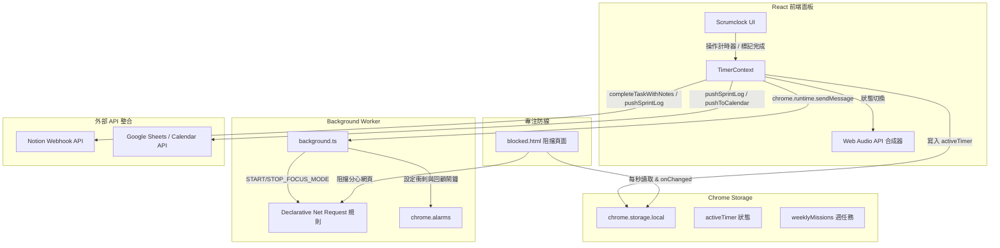

# 🍅 Scrumclock 瑞士刀：高效工作者的 AI 敏捷專注助理

Scrumclock 是一款專為「頂尖高效工作者 (Hyper-Productive Worker / 10x Developer)」量身打造的 Chrome 擴充功能。它將**敏捷管理 (Scrum)**、**時間箱防禦 (Time-Boxing)** 與 **本地 AI 專案助理** 融為一體，旨在解決現代辦公環境中大腦超載、時間碎裂與頻繁上下文切換的痛點。

本專案貫徹 **「技術極簡、隱私安全、無敏感權限」** 且 **「對開發者最直覺好用」** 的原則，完全在 Client 端安全運行，支援用戶自備 Gemini API 金鑰。

---

## 🚀 快速開始 (Quick Start)

### 1. 建置與安裝步驟 (開發者模式)
1. 下載或複製本專案至本地目錄。
2. 開啟終端機，進入 `chrome_scrumclock` 目錄，執行 `npm install` 安裝依賴。
3. 執行 `npm run build` 編譯專案，編譯完成後會生成 `dist/` 目錄。
4. 開啟 Chrome 瀏覽器，進入擴充功能管理頁面（於網址列輸入 `chrome://extensions/`）。
5. 開啟右上角的 **「開發者模式」** (Developer mode) 開關。
6. 點擊左上角的 **「載入未封裝擴充功能」** (Load unpacked)，並選擇本專案 `chrome_scrumclock` 目錄底下的 **`dist`** 資料夾。
7. 成功載入後，即可在瀏覽器工具列中釘選並啟動 **Scrumclock**。

### 2. 配置與啟用 AI 助理
*   **新版 Chrome 內建 AI (Gemini Nano)**：最新的 ScrumClock 助理支援 Chrome 內建的 Prompt API（相容最新規範之 `self.ai.languageModel` 與較舊的 `LanguageModel` 命名空間）。您不需要配置任何 API Key 或網路連接，模型直接在您的電腦上本地安全運行。請在 `chrome://flags` 中將 `Optimization Guide On Device Model` 與 `Prompt API for Gemini Nano` 啟用 (Enabled) 即可使用。
*   **自備 Gemini API Key (非內建) 備用模式**：若您的瀏覽器版本不支援內建 AI，仍可於設定面板填入您的免費 **Gemini API Key**（可於 [Google AI Studio](https://aistudio.google.com/) 申請）並儲存至本地 `chrome.storage.local` 以進行雲端 API 調用。

---

## 🧑‍💻 核心痛點與設計思維 (Persona)

### **核心人物誌：Max (資深技術主管 / 專案經理)**
*   **大腦 RAM 滿載**：靈感或待辦事項常常在開會或寫 code 的心流中突然冒出，切換視窗去記錄會打斷當前專注。
*   **碎步化時間**：完整的專注時間被會議切得稀碎，難以進入深度工作 (Deep Work)。
*   **上下文切換頻繁**：每天要在 Jira、Notion、Google Calendar、GitHub 之間來回切換數十次。
*   **時間過度承諾**：常常高估自己的時間，把「今天要做的事」排得太滿。

---

## 🎯 9 大已實現之核心功能模組

### 模組一：閃電捕捉 (Quick Capture)
*   **解決痛點**：大腦 RAM 滿載。
*   **操作體驗**：按下全域 Chrome 快捷鍵 `Alt + K`，彈出 Scrumclock 快速輸入框，在一秒內清空大腦靈感，按下 `Enter` 自動寫入 Google Tasks 或今日回顧「靈感區」，絕不打斷心流。

### 模組二：會議防禦陣地 (Time-Boxing Defender)
*   **解決痛點**：碎步化時間。
*   **操作體驗**：當啟動「番茄鐘衝刺」時，系統自動透過 Google Apps Script API 在您的 Google 日曆上建立一個名為 `[Deep Work] 不可打擾` 的事件，提醒同事不要在此時段發送會議邀請。番茄鐘結束後自動解除。

### 模組三：辦公室傳送門 (Hub / Bookmarks)
*   **解決痛點**：頻繁的上下文切換。
*   **操作體驗**：將擴充功能新分頁 (New Tab) 或側邊欄作為您的指揮中心，可自定義固定最常用的工作系統（如 Notion、GitHub、Jira）的圖示與連結，點擊即可一鍵開啟。

### 模組四：鍵盤即王道 (Command Palette)
*   **解決痛點**：滑鼠點擊效率低下。
*   **操作體驗**：按下 `Cmd + K` (Mac) 或 `Ctrl + P` (Windows) 呼叫全鍵盤指令列。輸入 `> sprint` 啟動番茄鐘，輸入 `> review` 進入成果回顧，輸入 `> block [網址]` 將當前網頁加入黑名單。

### 模組五：AI 任務拆解與動態規劃 (AI Planner)
*   **解決痛點**：大任務拖延症與僵化的時間盒。
*   **操作體驗**：點擊「✨ AI 幫我拆」按鈕，呼叫 Gemini 自動產出 3-4 個子任務；番茄鐘計時器可根據任務建議時間，動態適應 15 或是 50 分鐘；並在衝刺前自動顯示歷史踩坑教訓 (`aiTip`)。

### 模組六：網路層級專注防禦 (DNR Focus Blocker)
*   **解決痛點**：手癢點開分心網站（如 YouTube）。
*   **操作體驗**：使用 Manifest V3 的 `chrome.declarativeNetRequest` (DNR) API，在番茄鐘啟動期間，直接在瀏覽器底層攔截黑名單網站，並導向至專屬的靜心阻擋頁面 (`blocked.html`)，極低 CPU 損耗。

### 模組七：綠色熱力圖激勵 (GitHub Heatmap)
*   **解決痛點**：缺乏長期專注的視覺反饋。
*   **操作體驗**：在 Analytics 數據統計面板提供 GitHub 風格的綠色方塊熱力圖，視覺化呈現每天累積完成的番茄鐘顆數與專注時間。

### 模組八：離線保護與網頁 Context 抓取 (Offline & Context)
*   **解決痛點**：網路斷線數據丟失，以及手動複製網址的繁瑣。
*   **操作體驗**：
    *   **Offline Batch Sync**：網路斷線時自動將衝刺 Log 暫存至本地 `offlineQueue`，連線後自動 flush 同步。
    *   **Context URL Capture**：快捷捕捉當前活動網頁的標題與網址，並自動附加到任務備註中。

### 模組九：內建 Gemini 本地側欄助理與生態系深度整合 (Chrome Side Panel & Gemini Nano Copilot)
*   **解決痛點**：高昂的雲端 AI 網路開銷與隱私外洩疑慮，以及任務拆解與計時狀態的手動填寫繁瑣。
*   **操作體驗**：
    *   **本地側欄助理**：點擊 Action 圖示直接開啟右側側欄助理，全本地端運行，保護資料隱私。
    *   **雙向生態連動**：
        *   **一鍵匯入任務與選取文字**：點擊匯入或右鍵選取文字點擊「傳送至 ScrumClock 助理分析」，即可拉起側欄自動載入並進行任務拆解。
        *   **逆向寫入今日戰役**：一鍵解析助理回覆中的任務與 🍅 數，直接更新並寫入今日儀表板。
        *   **口語化任務指令背景執行 (Daily Mission Automation)**：側欄助理具備 Gemini Nano 語意解析，能辨識口語指令（如「新增核心戰役：[任務名稱]」、「完成 [任務名稱]」、「刪除 [任務名稱]」）並直接在背景修改 Storage 狀態，與 `weeklyMissions` 及 `dailyLogs` 同步，解決以往一鍵寫入產生的「未知任務」關聯 Bug。
        *   **生態系安全跳轉 (Secure Redirection)**：當使用者在官方 Gemini 網頁中點擊懸浮 Widget 的「開啟 ScrumClock 儀表板」時，Content Script (`geminiContent.ts`) 透過 Service Worker 通訊向背景傳送訊息，由 `background.ts` 調用特權 API 安全開啟分頁，解決 `ERR_BLOCKED_BY_CLIENT` 封鎖問題，並避免洩漏內部資源。
        *   **實時番茄鐘計時狀態條**：側欄頂部顯示當前番茄鐘進行/休息狀態倒數，並在結束時主動提示敏捷成果回顧。
        *   **載入歷史官方對話**：可於側欄直接載入並續接先前由 `geminiContent.ts` 抓取的官方歷史對話。

## 📁 目錄與檔案結構 (Project Structure)

本專案採用現代化的前端與多入口 Chrome 擴充功能物理聚合 (Co-location) 架構，所有頁面入口的 HTML 與 TypeScript 代碼均模組化管理：

```
chrome_scrumclock/
├── dist/                # 編譯產出目錄 (載入 Chrome 的目標)
├── docs/                # 技術與規格文件
├── public/              # 靜態資源 (包含 manifest.json、阻擋頁 blocked.html 與圖示)
├── src/
│   ├── entries/         # 多入口頁面物理聚合區
│   │   ├── newtab/      # 新分頁 (New Tab) 指揮中心 (React)
│   │   │   ├── index.html
│   │   │   └── main.tsx
│   │   ├── popup/       # 瀏覽器圖示點擊彈窗 (React)
│   │   │   ├── index.html
│   │   │   └── main.tsx
│   │   ├── sidebar/     # 側欄助理 (React)
│   │   │   ├── index.html
│   │   │   └── main.tsx
│   │   └── options/     # 獨立全域系統設定頁 (React)
│   │       ├── index.html
│   │       └── main.tsx
│   ├── components/      # 跨頁面共享 React UI 元件 (如 SettingsPanel)
│   ├── core/            # 核心系統層 (Chrome API 封裝、同步服務、API 配接器)
│   ├── features/        # 功能模組化架構 (包含 scrumclock、AI 側邊欄、書籤等)
│   ├── types/           # 全域與功能模組的 TypeScript 型別定義 (d.ts)
│   ├── utils/           # 共享工具函式 (如時間格式化、DOM 輔助)
│   ├── App.tsx          # 共享入口的 React 主根元件
│   ├── background.ts    # Background Service Worker (背景持久計時核心與安全訊息分發)
│   ├── content.ts       # 網頁通用內容注入腳本
│   ├── geminiContent.ts # 針對 Google Gemini 官方網頁的專屬對話抓取與互動 Widget 注入腳本
│   └── index.css        # 全域 TailwindCSS 樣式
├── vite.config.ts       # Vite 多入口編譯配置
└── tsconfig.json        # TypeScript 配置
```

---

## 🏗️ 系統架構與資料流向

以下展示了 React 前端面板、Chrome Storage 本地資料庫、Background Worker (Service Worker) 之間的交互關係與通訊管道：



### 💡 架構設計特點：
*   **狀態一致性 (SSOT)**：所有核心狀態儲存於 `chrome.storage.local`，各組件實時監聽，確保數據 100% 同步。
*   **計時持久化**：將核心計時引擎託管給 `background.ts` (結合 Chrome Alarms API)，即使 Popup 或 Sidebar 視窗被使用者關閉，番茄鐘計時仍能精準運行。
*   **Canvas 隔離設計**：專案助理使用「複製 ➔ 側邊欄處理任務 ➔ 覆蓋貼回」的剪貼簿橋樑，避開 Google Docs 的 Canvas DOM 讀寫難題，保障 100% 穩定且無需敏感權限。

---

## 📅 未來發展路徑 (Roadmap)

我們規劃了以下 4 大極簡但具備強大生產力提升效果的整合附加功能，這些功能均不需要申請額外的 Chrome 敏感主機權限，且能在 Client 端完美運行：

1.  **智慧文獻與靈感收集箱 (Smart Scratchpad)**：點擊右鍵選單自動將網頁選取文字以 Markdown 引用格式存入本地 `chrome.storage.local` 暫存區，不佔用系統剪貼簿，並可一鍵傳給 AI 進行整理。
2.  **一鍵網頁內容注入與總結 (Web Context Summarizer)**：一鍵調用 scripting 抓取當前網頁主要文字（限制 3000 字防止爆 Token），包裹成 Prompt Context 供 AI 快速進行 PR 總結或 API 代碼撰寫。
3.  **會議語音結論聽寫與 AI 派發 (Voice Meeting Extractor)**：調用 Chrome 內建且免費的 Web Speech API，在 Client 端進行實時語音轉文字，並利用 AI 萃取 Action Items 一鍵匯入 Tasks，零付費、隱私安全。
4.  **AI 工作日報與週報自動生成器 (Focus Journey Reporter)**：一鍵讀取並序列化今日的 `dailyLogs` 專注紀錄與「成果反思」內容，自動產出專業的工作日報，並支援一鍵複製貼往 Slack、Teams 或 Notion。