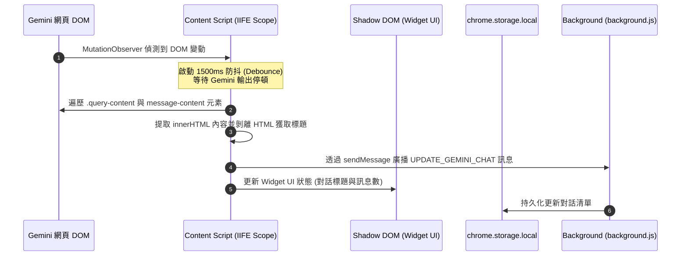

# 技術規格說明書：Gemini 網頁對話監聽與懸浮小助手 (geminiContent.ts)

本文件詳述了每日循環儀表板 (ScrumClock) 擴充功能中，注入於 Gemini 網頁的 Content Script 模組 `geminiContent.ts` 的技術實現、架構設計、安全規範與維護指引，供後續開發與版本維護使用。

---

## 1. 模組概述

- **檔案路徑**：`src/geminiContent.ts`
- **編譯輸出**：`dist/geminiContent.js`
- **加載網域**：`https://gemini.google.com/*`
- **主要職責**：
  1. **對話擷取與解析**：即時監聽 Gemini 的對話 DOM，解析提問與回答內容，將 HTML 富文本結構同步給後台。
  2. **懸浮 Widget 注入**：在 Gemini 網頁右下角注入一個具備 Glassmorphism 美學的懸浮控制面板（ScrumClock Widget），提供手動同步、一鍵導出 Markdown 與打開 ScrumClock 儀表板等快捷操作。

---

## 2. 架構工作流



---

## 3. DOM 解析與擷取規格

為了高容錯地適應 Google 頻繁的前端代碼更新，我們採用了相對穩定的原生標籤與特徵類別進行定位：

### 3.1. 元素定位 selector
```typescript
const elements = document.querySelectorAll('.query-content, message-content');
```
- **`.query-content`**：使用者發送提問的文字區塊。
- **`message-content`**：Gemini 官方用以包裹 AI 回覆的自訂 HTML 標籤（極為穩定，不會因前端 Hash 混淆而變動）。
- **順序保證**：利用 `querySelectorAll` 的特性，獲取的節點列表會完全按照網頁上 DOM 的先後渲染順序（即 User 與 Gemini 的對話交替順序）排列。

### 3.2. 資料格式化
每個提取出的對話回合會封裝成以下結構：
```typescript
interface GeminiMessage {
  role: 'user' | 'model';
  content: string; // 儲存該元素的 innerHTML 以保留完整排版與圖片
}

interface GeminiConversation {
  id: string;        // 擷取自 window.location.pathname (/app/[conversation_id])
  title: string;     // 取第一個使用者提問的 textContent (剝離 HTML，防禦 XSS)
  messages: GeminiMessage[];
  timestamp: number;
}
```

---

## 4. 懸浮小助手 (ScrumClock Widget) 設計規格

為了不污染 Gemini 宿主網頁的樣式並避免被其 CSS 干擾，Widget 採用 **Shadow DOM (Open Mode)** 技術實現樣式防禦。

### 4.1. 樣式防禦隔離 (Shadow DOM)
- **宿主 Host**：在全域 DOM 中掛載 `#scrumclock-widget-root` 的 `div` 容器。
- **Host 樣式**：
  ```css
  #scrumclock-widget-root {
    position: fixed;
    bottom: 90px;
    right: 24px;
    z-index: 2147483647; /* 設為最大值，防範宿主網頁 z-index 遮擋 */
    user-select: none;
  }
  ```
- **內部樣式**：所有按鈕、面板及動畫 CSS 完全塞在 shadow root 的 `<style>` 標籤中。

### 4.2. 狀態管理機制
定義 `widgetState` 對象，實作單向資料流更新 UI：
```typescript
const widgetState = {
  title: '未偵測到對話',
  messageCount: 0,
  status: 'idle', // 'idle' | 'syncing' | 'success' | 'error'
  lastSyncTime: null as number | null,
  activeConversation: null as GeminiConversation | null
};
```
在執行擷取、同步或發生錯誤時，主動更新 `widgetState.status` 並呼叫 `updateWidgetUI()` 來重繪面板文字和 Loading 反饋。

### 4.3. 可拖曳機制 (Draggable)
- **事件監聽**：監聽懸浮球 (FAB) 的 `mousedown`、`mousemove` 與 `mouseup`。
- **防止誤觸點擊**：在滑鼠移動距離大於 5 像素時才將 `isDragging` 標記設為 `true`，以避免與展開面板的 click 事件衝突。
- **座標持久化**：拖曳放開後，使用 `getBoundingClientRect()` 獲取當前 `left` 與 `top` 座標，並調用 `chrome.storage.local` 將其儲存在 `widgetPosition` 中。初始化時會自動載入該位置。

---

## 5. 安全與防護設計 (Security & Compliance)

### 5.1. 作用域保護：IIFE 包裹
- **問題**：Vite 在壓縮多個 Content Scripts 時，會產出相同的局部縮寫變數（如 `const n`）。當多個腳本注入到同一個網頁時，會拋出 `SyntaxError: Identifier 'n' has already been declared` 並引發崩潰。
- **對策**：整個腳本完全包裹在 **立即執行函數 (IIFE)** 閉包內：
  ```typescript
  (function () {
    // 所有的變數和邏輯都被封裝在局部作用域內，不污染全域
  })();
  ```

### 5.2. XSS 防禦與合規
- **標題消毒**：對話標題使用 `el.textContent` 提取，徹底剝離 HTML 標籤，防止使用者輸入的提問 HTML 在 App 側邊欄渲染時觸發 XSS。
- **CSP 合規**：Widget 中的機器人與時鐘圖示全部採用 **Inline SVG** 程式碼實作，完全不引用任何外部託管資源，完全符合 Manifest V3 的內容安全策略 (CSP) 限制。

---

## 6. 維護與更新指引

1. **打包更新**：
   - 每次修改 `geminiContent.ts` 後，必須在 `chrome_scrumclock` 目率下執行：
     ```bash
     npm run build
     ```
   - 打包會將代碼編譯並輸出至 `dist/geminiContent.js`。
2. **上架合規審查**：
   - 每次修改完後，必須執行 `python 0.doc_mg/tools/audit_manifests.py` 進行代碼安全與合規審計。
   - `geminiContent.ts` 中讀取 `innerHTML` 用以擷取富文本是符合規範的無害檢出，但應注意不可在 UI 上盲目渲染不受信任的外部來源 innerHTML。

---

## 7. 與本地側欄助理 (Sidebar Copilot) 的對話共享

新版本中，`geminiContent.ts` 擷取到的歷史對話與側欄助理實現了數據互通：
- **對話歷史儲存**：`geminiContent.ts` 抓取到的對話（儲存在 `chrome.storage.local` 下的 `geminiConversations` 中）將作為共享數據源。
- **側欄助理載入與續接**：使用者在任何網頁點擊開啟側欄助理時，可透過側欄 Header 的下拉選單點選這些官方 Gemini 歷史對話。側欄將自動還原該對話的歷史 Message 結構，並作為 Context 載入本地 AI Session 中，讓使用者能在本地側欄助理中，繼續針對官方對話內容進行敏捷拆解與延伸諮詢。
- **安全性保障**：共享載入的富文本內容，在側欄中會經由 React Elements 專屬的安全 Markdown 解析器渲染，100% 免疫 XSS。
