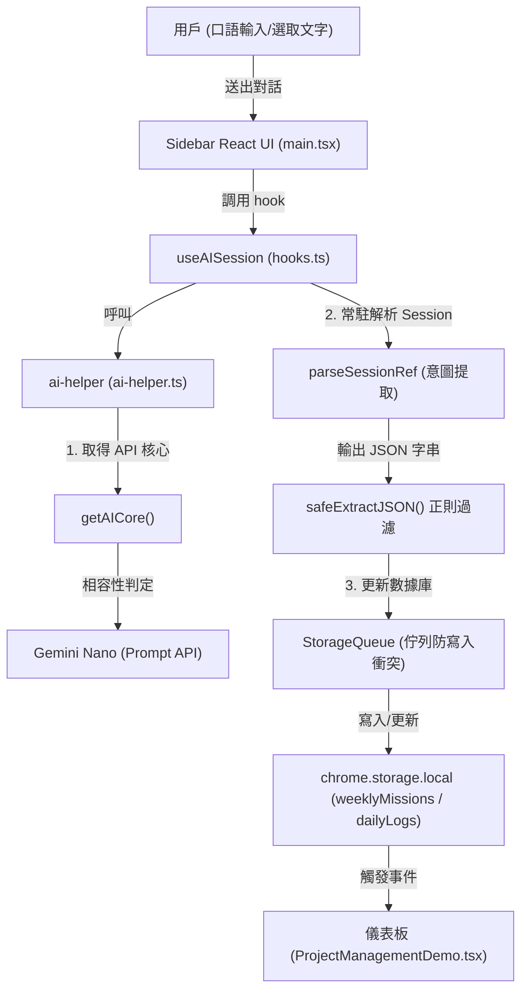

# 🧠 Chrome ScrumClock - 本地端 Gemini Nano (Prompt API) 技術規格書

本文件為 **Chrome ScrumClock** 擴充功能中整合 Google Chrome 內建 AI（Gemini Nano / Prompt API）的完整技術規格與維護手冊，旨在規範後續開發者對本機 AI 側欄助理、語意解析與任務資料流同步功能的維護與升級。

---

## 1. 系統概述與架構

ScrumClock 的 AI 助理完全運行於用戶的本地瀏覽器中，不依賴任何外部雲端伺服器或 API Key。其核心價值在於解決：
1. **隱私與安全**：用戶的每日反思與專案任務皆為敏感資訊，本地運行確保 100% 資料隱私。
2. **零延遲與零成本**：本地端推理，無高昂的雲端 Token 開銷。
3. **無縫整合**：側欄助理即時監聽用戶語意，將口語化的進度匯報或指令，動態解析並寫入儀表板。

### 核心資料流向 (Data Flow)



---

## 2. API 相容性與能力檢測 (Capability Detection)

由於 Chrome 內建 AI API 仍處於快速演進階段（從最早的早期預覽版命名空間到最新的標準 Draft 規範），ScrumClock 採用了**多重遞補相容性設計**。

### 2.1 命名空間遞補邏輯
為了相容於舊版 Canary/Dev 以及新版 Chrome 釋出的 Prompt API，系統在 [ai-helper.ts](file:///c:/Users/G1/00.coding%20workspace/chrome%20plus%20project/chrome_scrumclock/src/utils/ai-helper.ts) 的 `getAICore()` 中實作了以下順序遞補：

```typescript
export function getAICore(): any {
  // 1. 最新 Draft 規範 (例如 Chrome 128+)
  if (typeof self !== 'undefined' && (self as any).ai?.languageModel) {
    return (self as any).ai.languageModel;
  }
  // 2. 視窗全域
  if (typeof window !== 'undefined' && (window as any).ai?.languageModel) {
    return (window as any).ai.languageModel;
  }
  // 3. 插件特權背景命名空間
  if (typeof chrome !== 'undefined' && (chrome as any).aiLanguageModel) {
    return (chrome as any).aiLanguageModel;
  }
  // 4. 最早期 Canary 預覽版命名空間
  if (typeof (self as any).LanguageModel !== 'undefined') {
    return (self as any).LanguageModel;
  }
  return null;
}
```

### 2.2 多層級可用性檢測 (Capabilities Check)
某些瀏覽器版本可能只具備全域 API 物件，但模型尚未下載完成或不支援最新的 `capabilities()` 參數。系統在 `checkAiCapabilities` 中採用分級檢測與降級：
1. **若無 `capabilities` 方法**：直接檢測是否存在 `create` 函式。若有，則直接判定為可用（對應舊版 Canary 規格）。
2. **標準檢測**：傳入 `expectedInputs` 與 `expectedOutputs` 呼叫 `capabilities()`，判定模型是否就緒（`caps.available !== 'no'`）。
3. **第一層降級**：若帶參數呼叫出錯，降級為無參數 `capabilities()` 檢測。
4. **第二層降級**：若上述皆出錯，降級回直接判斷 `create` 函式是否存在。

---

## 3. 常駐會話生命週期管理 (Session Management)

內建 AI 的建立會佔用顯卡的 VRAM 記憶體。為防止記憶體洩漏與效能下降，ScrumClock 遵循以下會話管理規範：

### 3.1 Session 常駐與銷毀機制
在 [hooks.ts](file:///c:/Users/G1/00.coding%20workspace/chrome%20plus%20project/chrome_scrumclock/src/entries/sidebar/hooks.ts) 的 `useAISession` 中，我們宣告了兩個 React `useRef` 常駐會話：
* `aiSessionRef`：負責一般敏捷諮詢與對話。
* `parseSessionRef`：負責背景語意 JSON 意圖提取。

```typescript
const aiSessionRef = useRef<any>(null);
const parseSessionRef = useRef<any>(null);
```

#### 嚴格銷毀原則：
在組件被銷毀（Unmount）時，必須觸發 cleanup 函式，調用 `.destroy()` 釋放 VRAM。
```typescript
useEffect(() => {
  checkAndInitAI();

  return () => {
    if (aiSessionRef.current) {
      try { aiSessionRef.current.destroy(); } catch (e) { console.error(e); }
    }
    if (parseSessionRef.current) {
      try { parseSessionRef.current.destroy(); } catch (e) { console.error(e); }
    }
  };
}, []);
```

---

## 4. 語意解析與雙意圖提取引擎 (Semantic JSON Engine)

為了將用戶的口語內容（如「更新我的 ScrumClock 專案進度到 80%，目前正在優化 UI」）自動轉換成結構化資料，我們設計了一個**專案管理資料分析師**的常駐會話。

### 4.1 System Prompt 設計
`parseSessionRef` 在建立時被賦予了極為嚴格的 System Prompt，要求其**僅輸出 JSON**，並對兩大類意圖進行特徵提取：

1. **每週專案操作 (`project`)**：
   - 意圖：新增專案或更新現有專案的百分比與狀態描述。
   - 特徵詞：`新增專案`、`更新專案`、`目前完成幾%`、`卡在某問題` 等。
2. **今日每日任務操作 (`daily_mission`)**：
   - 意圖：今日核心戰役（每日任務）的 `新增`、`完成/標記完成`、`刪除/移除`。
   - 特徵詞：`新增今日任務`、`把...標記為完成`、`移除今日戰役` 等。
   - 優先判定規則：若用戶僅說「新增任務 ...」而未提及專案也無進度百分比，優先判定為 `daily_mission`。

### 4.2 JSON 安全提取與容錯 (safeExtractJSON)
由於本地端模型（Gemini Nano）偶爾會無視 Prompt 規範，夾帶 Markdown 代碼塊標記（如 ` ```json `）或廢話，系統透過 `safeExtractJSON` 進行正則過濾：
```typescript
export function safeExtractJSON(text: string): any {
  const match = text.match(/\{[\s\S]*\}/);
  if (!match) {
    throw new Error('未在 AI 回應中找到 JSON 結構。');
  }
  return JSON.parse(match[0]); // 僅擷取最外層的大括號區塊，確保 JSON 解析 100% 成功
}
```

---

## 5. 本地 Storage 同步與防競爭寫入 (Storage Synchronization)

由於 React 狀態與 Chrome Storage 寫入是非同步運作，當 AI 連續解析並嘗試修改同一份儲存資料時，可能會引發 **Race Condition (競爭危害)**。

### 5.1 佇列寫入鎖 (StorageQueue)
我們在 [hooks.ts](file:///c:/Users/G1/00.coding%20workspace/chrome%20plus%20project/chrome_scrumclock/src/entries/sidebar/hooks.ts) 中封裝了一個簡單的 `StorageQueue`。所有 AI 解析後對 `chrome.storage.local` 的修改均需進入排隊序列：
```typescript
export class StorageQueue {
  private queue: Promise<any> = Promise.resolve();

  enqueue<T>(task: () => Promise<T>): Promise<T> {
    return new Promise<T>((resolve, reject) => {
      this.queue = this.queue.then(async () => {
        try {
          const res = await task();
          resolve(res);
        } catch (err) {
          reject(err);
        }
      });
    });
  }
}
```

### 5.2 意圖寫入實作邏輯
當 `parseSessionRef` 解析出對應操作後，由以下兩個處理器進行 Storage 同步：
* `handleProjectActionUpdate`：
  - 比對現有任務池是否含有同名任務（部分關鍵字比對）。
  - 若有，更新進度百分比與狀態描述。
  - 若無，自動在 `weeklyMissions` 中建立一個新專案，並設定初始進度。
* `handleDailyMissionActionUpdate`：
  - 新增：將任務加入今日核心戰役，並同步確認/關聯 `weeklyMissions` 資料庫，預防產生找不到父任務的「未知任務」。
  - 完成：將今日戰役與對應的週任務同時標記為 `isCompleted = true`，並在 `dailyLogs` 中留下衝刺紀錄。
  - 刪除：自 `dailyLogs[today].coreBattles` 中安全移除。

---

## 6. 排錯與環境配置指引

要在開發環境中啟用並測試 Gemini Nano，請確保滿足以下瀏覽器配置：

### 6.1 Chrome 瀏覽器 Flag 配置
1. 開啟 Chrome 並進入 `chrome://flags`。
2. 搜尋並啟用以下兩項 Flag（設為 **Enabled**）：
   - `Optimization Guide On Device Model` ➔ 選擇 **Enabled BypassPerfRequirement** (繞過硬體門檻限制)
   - `Prompt API for Gemini Nano` ➔ 選擇 **Enabled**
3. 重新啟動瀏覽器 (Relaunch)。

### 6.2 檢查模型下載狀態
1. 進入 `chrome://components`。
2. 尋找 `Optimization Guide On Device Model`。
3. 點擊 **檢查更新 (Check for update)**，確保其狀態為「已是最新版本 (Up-to-date)」，這表示 Gemini Nano 模型已成功下載至本地端。

### 6.3 診斷除錯指令腳本
開發者可在任意網頁按 `F12` 開啟開發者工具 (DevTools) 並在 **Console** 中貼上執行以下腳本，進行本地環境檢測：

```javascript
(async () => {
  console.log("=== 本地 AI 偵測測試 ===");
  const getAICore = () => {
    if (typeof self !== 'undefined' && self.ai?.languageModel) return self.ai.languageModel;
    if (typeof window !== 'undefined' && window.ai?.languageModel) return window.ai.languageModel;
    if (typeof chrome !== 'undefined' && chrome.aiLanguageModel) return chrome.aiLanguageModel;
    if (typeof LanguageModel !== 'undefined') return LanguageModel;
    return null;
  };

  const aiAPI = getAICore();
  if (!aiAPI) {
    console.error("❌ 找不到任何本地 AI API 命名空間。請確認 Chrome flags 與 components 設定。");
    return;
  }
  console.log("✅ 成功偵測到 API 核心：", aiAPI);

  try {
    const caps = await aiAPI.capabilities();
    console.log("✅ capabilities 結果:", caps);
  } catch (e) {
    console.warn("⚠️ capabilities 檢測失敗 (可能是舊版不支援無參數呼叫):", e);
  }

  try {
    const session = await aiAPI.create({ systemPrompt: "你是一個測試助手。" });
    console.log("✅ 成功建立 Session！正在進行推理測試...");
    const response = await session.prompt("你好，請回覆『測試成功』四個字。");
    console.log("🎉 Prompt 回應結果:", response);
    session.destroy();
    console.log("✅ Session 銷毀成功，VRAM 已釋放。");
  } catch (e) {
    console.error("❌ 建立 Session 或 Prompt 推理失敗:", e);
  }
})();
```
