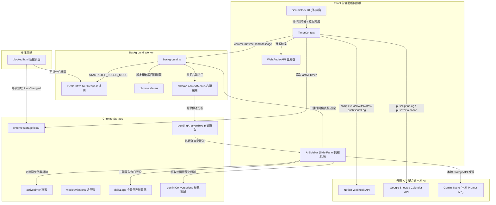
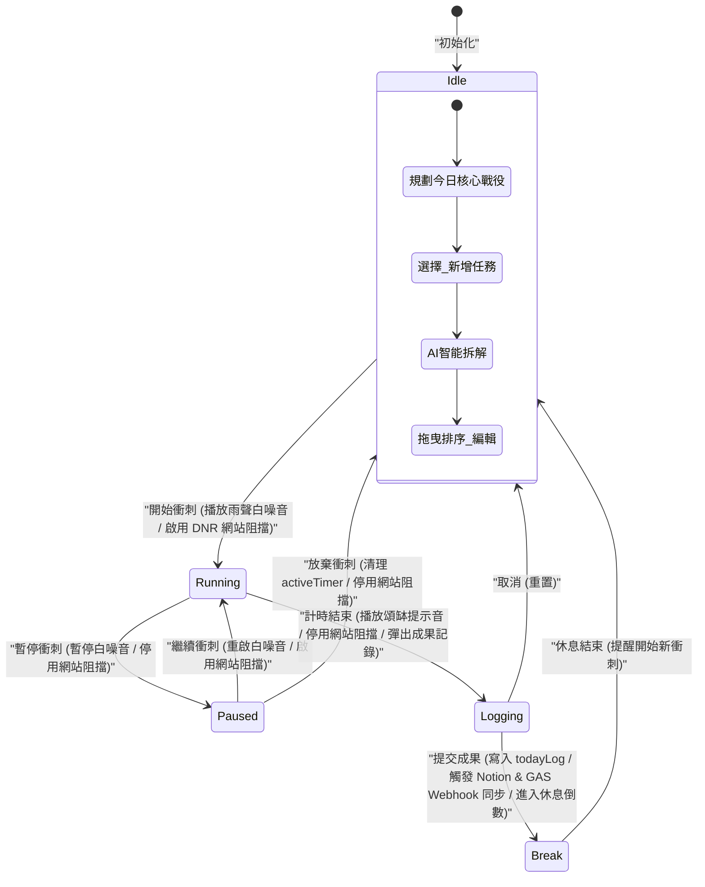
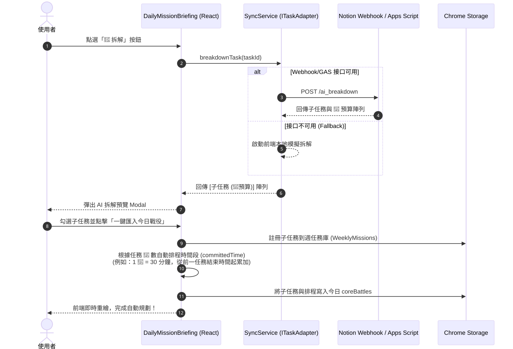
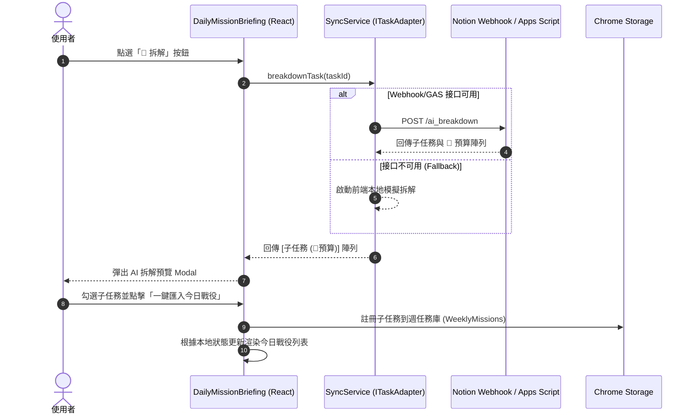
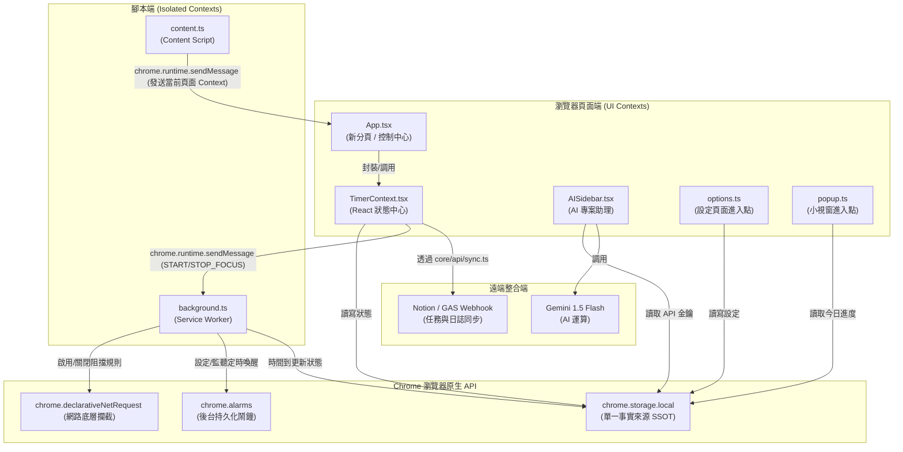

# Scrumclock 瑞士刀：系統架構與工作流設計文檔 (Workflow & Flowchart)

本文件旨在透過精緻的 **Mermaid 流程圖** 與詳細的技術導讀，協助開發者與使用者迅速理解 Scrumclock 的**系統架構**、**番茄鐘狀態生命週期**，以及 **AI 任務智能拆解與時間自動排程** 的核心設計。

---

## 1. 系統架構與資料流向圖 (Overall Architecture & Data Flow)

這張圖展示了 **React 前端面板**、**Chrome Storage 本地資料庫**、**Background Worker (Service Worker)**、**Blocked Page (分心網站防禦)** 以及 **外部 API 整合層** 之間的交互關係與資料通訊管道：

<p align="center">
  
</p>

<details>
<summary>📋 展開查看 Mermaid 原始碼</summary>


</details>

### 💡 架構設計優勢與細節說明：

*   **狀態一致性 (Single Source of Truth, SSOT)**：
    系統將計時器狀態與專注狀態持久化儲存於 `chrome.storage.local` 的 `activeTimer` 中。不論是 React UI 面板、背景服務程序 (Background Worker)，還是被阻擋分心網頁時重導向的 `blocked.html` 頁面，皆訂閱同一個 Storage 狀態。這確保了跨組件間數據的 100% 實時同步。
*   **背景計時持久化與資源節約**：
    Chrome 擴充功能的 Popup 或 Sidebar 視窗在失去焦點或關閉時會被瀏覽器銷毀。為了防止計時器中斷，Scrumclock 採用了將核心計時引擎託管給 `background.ts` 的設計。藉由 **Chrome Alarms API** 在後台精準喚醒與計時，前端 UI 僅作為一個無狀態的「顯示器 (View)」向背景訂閱時間更新。
*   **非侵入式專注防線 (DNR Blocker)**：
    不採用耗能且容易被瀏覽器安全機制警告的 Content Script 攔截法。Scrumclock 使用 Chrome 原生推薦的 **`declarativeNetRequest` (DNR)** API。在番茄鐘啟動期間，由背景程序動態啟用 DNR 阻擋規則；網頁請求直接在瀏覽器網路底層被攔截並重新導向至 `blocked.html`，既保護隱私又能極大化降低 CPU 損耗。

---

## 2. 番茄鐘狀態機與生命週期 (Pomodoro State Machine)

番茄鐘依循敏捷管理的思維，分為五個核心狀態：`idle`、`running`、`paused`、`logging`、`break`。各狀態之間的轉移條件與伴隨動作如下：

<p align="center">
  
</p>

<details>
<summary>📋 展開查看 Mermaid 原始碼</summary>


</details>

### 💡 狀態移轉技術細節說明：

*   **Idle (閒置狀態)**：使用者可在此狀態自由管理任務（增刪查改）、導入外部 Markdown 任務清單，或呼叫「🤖 拆解」按鈕啟動 AI 智能規劃。
*   **Running (衝刺狀態)**：前端 Web Audio API 啟動音效合成器，動態生成**紅噪音 (Brownian Noise)** 以模擬雨聲白噪音；同時背景程序啟動 DNR 網路層攔截。
*   **Logging (記錄狀態)**：當倒數計時歸零，系統自動進入此狀態。Web Audio API 模擬敲擊 **餘音頌缽音效** (由 5 個不同頻率的正弦波疊加諧振而成，帶有空靈的真實共鳴感) 提醒使用者。此時網路防線暫時解除，彈出結果記錄視窗，強制進行「收割反思」。
*   **Break (休息狀態)**：提交今日成果後進入休息狀態。計時歸零後返回 Idle 狀態，觸發通知，引導使用者開展下一輪專注衝刺。

---

## 3. AI 週任務智能拆解與時間自動排程 (AI Task Breakdown Sequence)

本功能整合了前端互動 UI、外部適配器 Webhook、以及本地的時間遞增排程算法，實施從「宏觀週任務」到「微觀今日核心戰役」的流暢轉換：

<p align="center">
  
</p>

<details>
<summary>📋 展開查看 Mermaid 原始碼</summary>


</details>

---

## 4. 專案目錄與元件通訊架構 (Project Structure & Communication)

### 4.1 專案目錄樹與職責分工

```text
chrome_scrumclock/
├── archive/                        # 歷史歸檔檔案
│   └── simple/                     # [原型存檔] 舊版純 JS 傳統擴充功能
├── docs/                           # 專案設計文件與架構流程圖
├── public/                         # 靜態資源 (不經 Vite 編譯直接輸出至 dist)
│   ├── manifest.json               # 擴充功能設定檔 (MV3)
│   ├── blocked.html                # DNR 攔截分心網站後的靜心引導頁
│   └── icons/                      # 擴充功能圖示 (SVG)
├── src/                            # React + TypeScript 核心程式碼
│   ├── entries/                    # 擴充功能各個 HTML 的主要 JS/TS 進入點
│   │   ├── newtab.tsx              # 新分頁儀表板入口 (原 main.tsx)
│   │   ├── popup.ts                # 工具列小彈窗腳本 (原 popup.js)
│   │   └── options.ts              # 設定頁面腳本 (原 options.js)
│   ├── App.tsx                     # 應用主組件 (整合版控制中心、側邊欄、命令列等)
│   ├── index.css                   # 全域樣式 (引入 Tailwind CSS)
│   ├── background.ts               # Background Service Worker (計時守護與 DNR 控制)
│   ├── content.ts                  # Content Script (用於頁面 Context 抓取)
│   ├── components/                 # 全域共用元件
│   │   └── SettingsPanel.tsx       # AI API 與同步選項設定面板
│   ├── core/                       # 核心基礎服務層 (跨模組共用)
│   │   ├── api/                    # 外部 API 與同步適配器
│   │   │   ├── gemini.ts           # Gemini API 客戶端
│   │   │   ├── ITaskAdapter.ts     # 任務適配器介面
│   │   │   ├── offlineQueue.ts     # 離線同步佇列控制
│   │   │   ├── sync.ts             # 同步服務分配中心
│   │   │   └── adapters/           # 外部服務實作 (Google Tasks, Notion)
│   │   ├── chrome/                 # Chrome API 封裝
│   │   │   └── storage.ts          # 本地 Storage 讀寫封裝
│   │   └── layout/                 # 系統 UI 外殼與控制面板佈局
│   │       ├── MainLayout.tsx      # 側邊欄與工作區主佈局
│   │       ├── Sidebar.tsx         # 主要側邊導覽列
│   │       └── CommandPalette.tsx  # 全局命令面板 (Ctrl+P / Cmd+K)
│   ├── features/                   # 功能特徵模組層 (按業務邏輯隔離)
│   │   ├── scrumclock/             # 番茄鐘與任務核心模組
│   │   │   ├── index.ts            # 模組統一匯出點
│   │   │   ├── contexts/           # 狀態管理
│   │   │   │   └── TimerContext.tsx # 計時器狀態 (SSOT 來源)
│   │   │   └── components/         # 專屬子元件
│   │   │       ├── SprintPomodoro.tsx # 番茄鐘計時元件
│   │   │       ├── DailyMissionBriefing.tsx # 週任務拆解與今日戰役
│   │   │       ├── QuickCapture.tsx  # 閃電捕捉 (Alt+K)
│   │   │       └── EndOfDayReview.tsx # 成果回顧與反思
│   │   ├── ai-sidebar/             # AI 專案助理模組
│   │   │   ├── index.ts
│   │   │   └── components/
│   │   │       └── AISidebar.tsx   # 剪貼簿快取與 Prompt 處理側邊欄
│   │   ├── analytics/              # 數據統計模組
│   │   │   ├── index.ts
│   │   │   └── components/
│   │   │       └── AnalyticsDashboard.tsx # GitHub 風格熱力圖與統計
│   │   ├── bookmarks/              # 辦公傳送門書籤模組
│   │   │   ├── index.ts
│   │   │   └── components/
│   │   │       └── BookmarksHub.tsx # 工作連結傳送門
│   │   ├── project-management/     # 專案管理整合模組
│   │   │   ├── index.ts
│   │   │   └── components/
│   │   │       └── ProjectManagementDemo.tsx # 專案任務看板 demo
│   │   └── experimental-srt/       # [實驗性] 字幕讀取與解析模組
│   │       ├── index.ts
│   │       ├── components/
│   │       │   └── SrtReader.tsx
│   │       ├── utils/
│   │       │   └── srtParser.ts
│   │       └── types/
│   │           └── srt.ts
│   └── types/                      # TypeScript 類型定義
├── index.html                      # 主儀表板 HTML (在新分頁展示)
├── popup.html                      # 擴充功能小視窗 HTML (瀏覽器工具列點擊)
├── options.html                    # 擴充功能設定頁 HTML
├── vite.config.ts                  # Vite 編譯設定檔 (指定入口與輸出)
└── tailwind.config.js              # Tailwind CSS 樣式配置
```

---

### 4.2 擴充功能進入點與 Vite 編譯對應關係

Chrome 擴充功能在運行時需要將特定檔案註冊於 `manifest.json` 中。本專案透過 `vite.config.ts` 中的 `rollupOptions.input` 多入口設定，將源文件編譯並對應如下：

| Chrome 擴充功能組件 | `public/manifest.json` 配置路徑 | 開發源文件 | Vite 編譯後產物 |
| :--- | :--- | :--- | :--- |
| **Background (Service Worker)** | `"background": { "service_worker": "background.js", "type": "module" }` | `src/background.ts` | `dist/background.js` |
| **Content Script** | `"content_scripts": [ { "js": ["content.js"], ... } ]` | `src/content.ts` | `dist/content.js` |
| **Popup (工具列彈出視窗)** | `"action": { "default_popup": "popup.html" }` | `popup.html` -> `src/entries/popup.ts` | `dist/popup.html` + `dist/popup.js` |
| **Options (設定頁面)** | `"options_page": "options.html"` | `options.html` -> `src/entries/options.ts` | `dist/options.html` + `dist/options.js` |
| **Override Newtab (新分頁儀表板)**| `"chrome_url_overrides": { "newtab": "index.html" }` | `index.html` -> `src/entries/newtab.tsx` -> `src/App.tsx` | `dist/index.html` + `dist/index.js` 等合併產物 |
| **Blocked Page (網站阻擋頁)** | (由 `background.ts` DNR 重新導向至此) | `public/blocked.html` | `dist/blocked.html` (直接複製) |

---

### 4.3 運行時檔案交互與通信關聯

在 Extension 執行時，各個獨立的 Context (Popup, New Tab, Background, Content Script) 之間主要透過 **Chrome API 通信** 與 **本地儲存** 來達成狀態同步。



---

### 4.4 後續檔案歸檔與結構優化分析 (Refactoring Recommendations)

以下為專案架構重構的優化方向（均已在本次優化計畫中全數落實執行）：

1.  **歸檔原型目錄 `simple/`** *(已完成)*：
    *   *優化內容*：已將整個 `simple/` 目錄移入 `archive/simple/` 目錄，在 `README.md` 中標註為「歷史存檔/原型參考」，避免 AI 在進行代碼全局搜索時將其與主專案程式碼混淆。
2.  **腳本 TypeScript 化與位置重組** *(已完成)*：
    *   *優化內容*：
        *   將原本位於 `src/popup.js` 升級為 TypeScript，移至 `src/entries/popup.ts`，並在 `popup.html` 中引入。
        *   將原本位於 `src/options.js` 升級為 TypeScript，移至 `src/entries/options.ts`，並在 `options.html` 中引入。
        *   將原本位於 `src/main.tsx` 移動到 `src/entries/newtab.tsx`，作為主面板入口，並更新 `index.html` 引用。
        *   在 `src/` 下建立 `src/entries/` 目錄，將擴充功能的各個頁面/環境進入點代碼進行集中管理。
3.  **歸類非核心/實驗性模組** *(已完成)*：
    *   *優化內容*：將原本散落且未被引用的 `SrtReader.tsx` 與 `srtParser.ts` 實驗性字幕功能，整合並移入新建的特徵模組 `src/features/experimental-srt/` 目錄中，維持 `src/components` 和 `src/utils` 的純粹性。
4.  **清理空資料夾** *(已完成)*：
    *   *優化內容*：已直接刪除 `src/contexts/` 空資料夾，避免結構冗餘。

