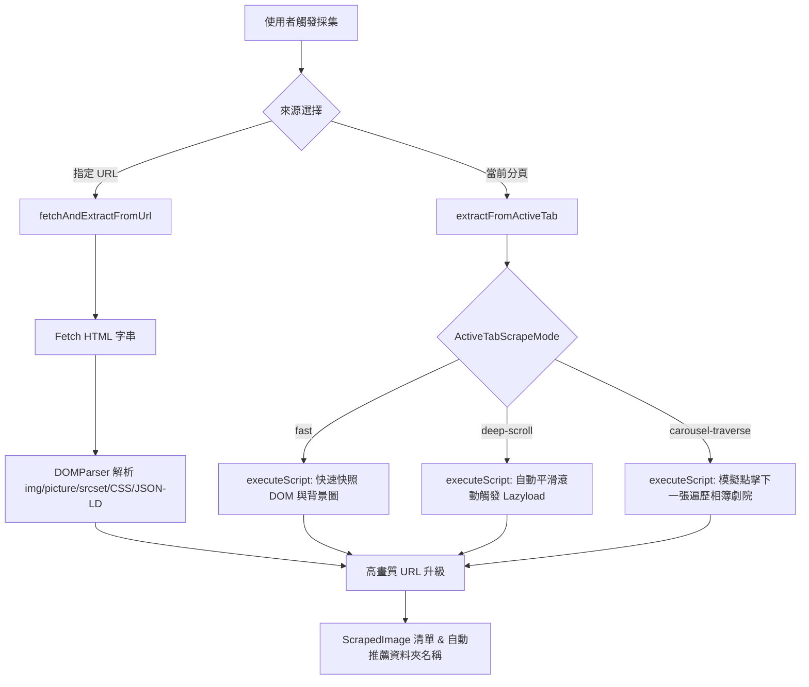

# 網頁圖片爬取與批量下載器 (Image Scraper) 功能說明

> **用途定位**：本文件為 `chrome_scrumclock` 插件之「實用工具箱 (Toolbox)」首發工具——網頁圖片爬取與下載器模組的精簡架構與技術指引，供後續開發與 AI 快速理解維護。

---

## 1. 核心架構與檔案地圖 (File Map)

模組採用 Feature-based 結構，落於 `src/features/toolbox/`，保持高內聚與零外部副作用：

| 檔案路徑 | 職責與關鍵內容 |
| :--- | :--- |
| [`index.ts`](file:///c:/Users/%E7%83%88%E6%97%A5%E5%8D%83%E9%99%BD/vide-coding-workspace/chrome-plus/chrome_scrumclock/src/features/toolbox/tools/image-scraper/index.ts) | **對外統一出口 (Barrel)**：封裝內部實作，向外部 ToolboxHub 與 Sidebar 匯出元件與型別。 |
| [`types.ts`](file:///c:/Users/%E7%83%88%E6%97%A5%E5%8D%83%E9%99%BD/vide-coding-workspace/chrome-plus/chrome_scrumclock/src/features/toolbox/tools/image-scraper/types.ts) | 核心介面定義：`ScrapedImage`, `ActiveTabScrapeMode`, `DownloadTaskOptions`, `DownloadProgress`, `CarouselProgress`。 |
| [`services/imageExtractor.ts`](file:///c:/Users/%E7%83%88%E6%97%A5%E5%8D%83%E9%99%BD/vide-coding-workspace/chrome-plus/chrome_scrumclock/src/features/toolbox/tools/image-scraper/services/imageExtractor.ts) | **圖片採集與解析引擎**：URL 靜態抓取、Active Tab 腳本注入（含快速快照、深度滾動、相簿輪巡）以及高畫質 URL 升級規則。 |
| [`services/downloader.ts`](file:///c:/Users/%E7%83%88%E6%97%A5%E5%8D%83%E9%99%BD/vide-coding-workspace/chrome-plus/chrome_scrumclock/src/features/toolbox/tools/image-scraper/services/downloader.ts) | **下載與匯出引擎**：`BatchDownloader` 併發佇列控制、`chrome.downloads` API、`FileSystemAccess` 原生目錄直存、URL 複製與 TXT 匯出。 |
| [`ImageScraper.tsx`](file:///c:/Users/%E7%83%88%E6%97%A5%E5%8D%83%E9%99%BD/vide-coding-workspace/chrome-plus/chrome_scrumclock/src/features/toolbox/tools/image-scraper/ImageScraper.tsx) | **主互動視圖 UI**：雙來源輸入切換、篩選列、Shift+Click 連續選取網格、燈箱大圖預覽、下載控制項與進度面板。 |
| [`dev-tools/`](file:///c:/Users/%E7%83%88%E6%97%A5%E5%8D%83%E9%99%BD/vide-coding-workspace/chrome-plus/chrome_scrumclock/src/features/toolbox/tools/image-scraper/dev-tools) | **開發除錯工具庫**：集中存放 Instagram 探測腳本、離線 HTML 樣本等實驗性測試工具。 |

---

## 2. 圖片採集工作流程 (Scraping Pipeline)

採集器支援**兩種來源**與**三種分頁採集模式**：

### 採集模式詳解 (`ActiveTabScrapeMode`)
1. **快速快照 (`fast`)**：直接掃描當前分頁可見 DOM 的 ``、`<video>`、`<svg>`、CSS `background-image` 與 OpenGraph/Twitter 圖片與影片 Meta。
2. **深度滾動 (`deep-scroll`)**：以指定步長滾動頁面，持續監聽並觸發各框架的 Lazy Loading 載入，直至頁底或達到上限。
3. **相簿劇院輪巡 (`carousel-traverse`) 與 Instagram 專屬影音提取架構**：
   - 專為 Instagram、Facebook、Twitter、Threads 等燈箱/劇院/串流影音設計。
   - **Instagram 深度影音提取引擎 (`extractInstagramPostDirectly`)**：
     無論使用者選擇快速快照、深度滾動或相簿輪巡，只要進入 Instagram 貼文/Reels（如 `instagram.com/p/...` 或 `reel/...`），第一優先啟動專屬影音採集管線：
     1. **官方原生高畫質直鏈挖掘 (`browser_native_hd_url` / `browser_native_sd_url`)**：
        - 深入掃描頁面內聯 `<script>` 標籤，匹配官方為純 HTML5 播放器準備的原生 1080p 單檔 MP4 連結。
        - 針對 JSON 轉義網址自動進行 `\u0026` -> `&`、`\/` -> `/` 清理與 URL 正規化。
     2. **貼文 Shortcode 嚴格作用域綁定**：
        - 萃取目前網址中之短代碼（如 `/p/DbPu-KzvdnG/` -> `DbPu-KzvdnG`），嚴格限制腳本只萃取該貼文所屬區塊之媒體。
        - **徹底排除全域預載污染**：禁止對全頁 HTML 進行寬鬆的 `.mp4` 全域正則搜尋，杜絕 SPA 快取預載出 200+ 個無效推薦影片分塊。
     3. **DASH / MSE Range 分塊防禦機制**：
        - Instagram 網頁版播放器全面使用 MediaSource Extensions 虛擬 `blob:https://...` 協議，底層透過 HTTP Range 請求極短分塊。
        - 系統自動過濾所有帶有 `bytestart=` 或 `byteend=` 參數之請求與 CDN 網址，杜絕抓到缺少 `moov atom` 索引頭部、時長為 0:00 的破裂無效影片。
     4. **DOM React Fiber 實例探測**：
        - 深入當前 `<article>` 或貼文容器節點的 `__reactFiber$` / `__reactProps$` 實例，向上追溯 MemoizedProps，取得完整的 `video_versions` 與 `playback_url`。
     5. **封面海報 (Poster) 關聯**：
        - 自動抓取貼文 `<video poster="...">` 或主圖 `` 作為影片預覽縮圖，讓工具箱介面即時呈現具體畫面與 `🎥 MP4` 徽章。
   - **DOM 輪巡與隔離**：嚴格鎖定當前貼文 `<article>` 作用域，排除外層按鈕；支援輪播中影片與照片混合採集。
   - **擴充套件原生串流下載 (`downloader.ts`)**：
     - 影片檔案優先在具備 `<all_urls>` 權限之擴充功能 Background / Panel Context 直接使用原生 `fetch()` 串流轉換為 Blob。
     - 避免透過 `executeScript` 將數十 MB 的二進位影片轉為 Base64 Data URL 傳輸，徹底解決分頁記憶體溢出與主執行緒卡頓問題。
   - 支援即時中斷 (`abortTraverseRef`) 與進度回饋 (`CarouselProgress`)。

---

## 3. 高畫質 URL 自動升級 (HD Upgrade Rules)

採集時自動比對並替換為 CDN 原始/高清大圖路徑：
- **Flickr 升級** (`upgradeFlickrImageUrl`)：
  - 匹配 `staticflickr.com/..._{size}.jpg`
  - 將 `_m` (小圖), `_n`, `_z`, `_s` 等後綴自動替換為 `_b` (1024px 高清)。
- **Facebook / Instagram 高畫質與簽名保護** (`upgradeFacebookImageUrl`)：
  - 支援 `*.fbcdn.net` 與 `*.cdninstagram.com` CDN 網址。
  - **數位簽名防護**：針對具備防偽 HMAC 數位簽名（如帶有 `oh=`, `_nc_ht=`, `oe=` 等參數）的 Meta / Instagram 網址，嚴禁修改 `stp` 查詢參數，以確保圖片下載時不會因簽名失效而遭受 HTTP 403 拒絕存取。
  - Instagram 貼文原生解析所取得之 `candidates[0]` 本身即為 1080px 最高畫質原圖，由系統直接提供高解析直鏈下載。

---

## 4. 篩選、選取與下載機制

### (1) 多維度篩選與 Shift 範圍選取
- **即時過濾與格式連動 (Format Selection Sync)**：
  - 支援依格式（JPG/PNG/WEBP/GIF/SVG/MP4/WEBM）、最小寬度、URL 或 Alt 關鍵字過濾。
  - **影音標籤與徽章**：影片項目自動附帶 `🎥 MP4` 徽章與封面海報縮圖，點擊燈箱可直接調用內建播放器進行即時預覽。
  - **智慧取消勾選機制**：凡不在當前格式篩選範圍內的圖片/影片，系統會自動將其設為取消勾選 (`selected = false`)，徹底杜絕下載非目標格式之檔案。
  - **Solo 快捷模式**：按住 `Alt` 鍵點擊任一格式標籤，可直接單選該格式並連動排除其他格式之勾選。
- **全選 / 反選**：僅針對當前「已篩選顯示 (filtered)」的圖片進行選取狀態變更。
- **Shift + Click 範圍多選**：使用者點擊圖片 A，按住 Shift 點擊圖片 B，自動連選 A~B 之間的所有項目。

### (2) 整合原生目錄直存下載引擎 (`downloader.ts`)
1. **預設原生目錄直存 (File System Access API)**：
   - 點擊「選取資料夾並下載圖片」，呼叫 `window.showDirectoryPicker()` 取得目錄 Handle。
   - 下載時直接將真實二進制 Blob（包含高畫質 JPG 與大型 MP4 影片）寫入指定資料夾，**完全避免**瀏覽器重複彈出下載確認視窗，且具備更換資料夾切換功能。
2. **防盜鏈與副檔名穿透保護 (fetchMediaBlob)**：
   - 先行將遠端媒體轉換為二進制 Blob，若遭遇 403 防盜鏈則透過作用中分頁 Context 代理快取穿透。
   - 杜絕 Chrome 下載管理器因收到純文字 403 錯誤而將圖片強制改名為 `.txt` 壞檔之問題。
3. **極簡 UI/UX 設計**：
   - 全面移除容易造成混淆的「複製 URL」與「匯出 TXT」文字清單按鈕，僅保留核心清晰的一鍵下載主按鈕與更換資料夾功能。

---

## 5. 後續維護與擴充指引

- **新增社群網站大圖/影片規則**：
  若需支援 X (Twitter)、Pinterest 或小紅書的大圖/影片升級，直接於 `imageExtractor.ts` 的 `upgradeImageUrl()` 增加對應正規表達式處理。
- **新增相簿「下一張」按鈕選擇器**：
  若特定平台劇院按鈕無法觸發，前往 `imageExtractor.ts` 中的輪巡按鈕查詢選擇器擴充。
- **權限需求**：
  本模組仰賴 Manifest 中的 `"downloads"`, `"scripting"`, `"tabs"`, `"<all_urls>"`。擴充跨域採集時請確保不違反 CSP。
