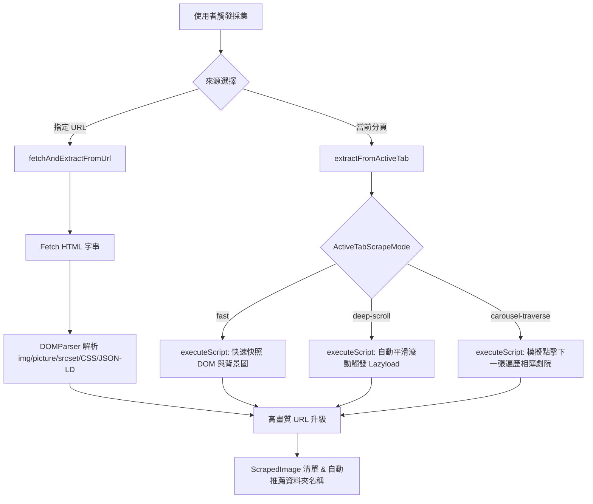

# 網頁圖片爬取與批量下載器 (Image Scraper) 功能說明

> **用途定位**：本文件為 `chrome_scrumclock` 插件之「實用工具箱 (Toolbox)」首發工具——網頁圖片爬取與下載器模組的精簡架構與技術指引，供後續開發與 AI 快速理解維護。

---

## 1. 核心架構與檔案地圖 (File Map)

模組採用 Feature-based 結構，落於 `src/features/toolbox/`，保持高內聚與零外部副作用：

| 檔案路徑 | 職責與關鍵內容 |
| :--- | :--- |
| [`index.ts`](file:///c:/Users/%E7%83%88%E6%97%A5%E5%8D%83%E9%99%BD/vide-coding-workspace/chrome-plus/chrome_scrumclock/src/features/toolbox/tools/image-scraper/index.ts) | **對外統一出口 (Barrel)**：封裝內部實作，向外部 ToolboxHub 與 Sidebar 匯出元件與型別。 |
| [`types.ts`](file:///c:/Users/%E7%83%88%E6%97%A5%E5%8D%83%E9%99%BD/vide-coding-workspace/chrome-plus/chrome_scrumclock/src/features/toolbox/tools/image-scraper/types.ts) | 核心介面定義：`ScrapedImage`, `ActiveTabScrapeMode`, `DownloadTaskOptions`, `DownloadProgress`, `CarouselProgress`。 |
| [`services/imageExtractor.ts`](file:///c:/Users/%E7%83%88%E6%97%A5%E5%8D%83%E9%99%BD/vide-coding-workspace/chrome-plus/chrome_scrumclock/src/features/toolbox/tools/image-scraper/services/imageExtractor.ts) | **圖片採集與解析引擎**：URL 靜態抓取、Active Tab 腳本注入（含快速快照、深度滾動、相簿輪巡）以及高畫質 URL 升級規則。 |
| [`services/downloader.ts`](file:///c:/Users/%E7%83%88%E6%97%A5%E5%8D%83%E9%99%BD/vide-coding-workspace/chrome-plus/chrome_scrumclock/src/features/toolbox/tools/image-scraper/services/downloader.ts) | **下載與匯出引擎**：`BatchDownloader` 併發佇列控制、`chrome.downloads` API、`FileSystemAccess` 原生目錄直存、URL 複製與 TXT 匯出。 |
| [`ImageScraper.tsx`](file:///c:/Users/%E7%83%88%E6%97%A5%E5%8D%83%E9%99%BD/vide-coding-workspace/chrome-plus/chrome_scrumclock/src/features/toolbox/tools/image-scraper/ImageScraper.tsx) | **主互動視圖 UI**：雙來源輸入切換、篩選列、Shift+Click 連續選取網格、燈箱大圖預覽、下載控制項與進度面板。 |
| [`dev-tools/`](file:///c:/Users/%E7%83%88%E6%97%A5%E5%8D%83%E9%99%BD/vide-coding-workspace/chrome-plus/chrome_scrumclock/src/features/toolbox/tools/image-scraper/dev-tools) | **開發除錯工具庫**：集中存放 Instagram 探測腳本、離線 HTML 樣本等實驗性測試工具。 |

---

## 2. 圖片採集工作流程 (Scraping Pipeline)

採集器支援**兩種來源**與**三種分頁採集模式**：

### 採集模式詳解 (`ActiveTabScrapeMode`)
1. **快速快照 (`fast`)**：直接掃描當前分頁可見 DOM 的 ``、`<svg>`、CSS `background-image` 與 OpenGraph Meta。
2. **深度滾動 (`deep-scroll`)**：以指定步長滾動頁面，持續監聽並觸發各框架的 Lazy Loading 載入，直至頁底或達到上限。
3. **相簿劇院輪巡 (`carousel-traverse`)**：專為 Facebook、Instagram、Twitter、Threads 等燈箱/劇院模式設計。
   - **Instagram 雙軌採集**：進入分頁後優先透過同源 Context 讀取貼文原生輪播資料（秒級直出 14 張高清大圖）；若為純 DOM 模式，則自動定位貼文容器，精準點擊「下一頁」按鈕（支援繁中/簡中/英文與 SVG 標籤向上穿透至父層按鈕），並以「按鈕消失」作為天然終止信號，逐張收集至最後一張。
   - **Facebook 劇院模式**：點擊大圖劇院模式後，透過識別 Next 按鈕與鍵盤事件逐張擷取大圖。
   - 支援即時中斷 (`abortTraverseRef`) 與進度回饋 (`CarouselProgress`)。

---

## 3. 高畫質 URL 自動升級 (HD Upgrade Rules)

採集時自動比對並替換為 CDN 原始/高清大圖路徑：
- **Flickr 升級** (`upgradeFlickrImageUrl`)：
  - 匹配 `staticflickr.com/..._{size}.jpg`
  - 將 `_m` (小圖), `_n`, `_z`, `_s` 等後綴自動替換為 `_b` (1024px 高清)。
- **Facebook / Instagram 升級** (`upgradeFacebookImageUrl`)：
  - 支援 `*.fbcdn.net` 與 `*.cdninstagram.com` CDN 網址。
  - 去除路徑中的縮圖裁切標籤（例如 `/p206x206/`, `/s320x320/`, `/p526x296/`）。
  - 自動清除裁切與縮放查詢參數（`stp=c0.120.1080.1080a...`、`s640x640` 等），全量升級還原為 1080px+ 原始高畫質原圖。

---

## 4. 篩選、選取與下載機制

### (1) 多維度篩選與 Shift 範圍選取
- **即時過濾與格式連動 (Format Selection Sync)**：
  - 支援依格式 (JPG/PNG/WEBP/GIF/SVG)、最小寬度、URL 或 Alt 關鍵字過濾。
  - **智慧取消勾選機制**：凡不在當前格式篩選範圍內的圖片，系統會自動將其設為取消勾選 (`selected = false`)，徹底杜絕下載非目標格式之檔案。
  - **Solo 快捷模式**：按住 `Alt` 鍵點擊任一格式標籤，可直接單選該格式並連動排除其他格式之勾選。
- **全選 / 反選**：僅針對當前「已篩選顯示 (filtered)」的圖片進行選取狀態變更。
- **Shift + Click 範圍多選**：使用者點擊圖片 A，按住 Shift 點擊圖片 B，自動連選 A~B 之間的所有項目。

### (2) 雙軌下載引擎 (`downloader.ts`)
1. **原生資料夾直存模式 (File System Access API)**：
   - 點擊「選擇下載資料夾」，呼叫 `window.showDirectoryPicker()` 取得目錄 Handle。
   - 下載時直接將 Blob 寫入指定資料夾，**完全避免**瀏覽器重複彈出下載確認視窗。
2. **Chrome Downloads API 模式**：
   - 未指定原生目錄時，使用 `chrome.downloads.download()`。
   - 支援將檔案歸類到預設下載目錄下的子資料夾 (`folderName/filename`)。
   - 內建併發限制隊列 (`concurrency: 3~5`) 與檔名非法字元清理 (`sanitizePathSegment`)。
3. **外部匯出輔助**：
   - 一鍵複製選取項目之 URL 清單至剪貼簿。
   - 匯出為純文字清單檔案 (`.txt`)。

---

## 5. 後續維護與擴充指引

- **新增社群網站大圖規則**：
  若需支援 X (Twitter)、Pinterest 或小紅書的大圖升級，直接於 `imageExtractor.ts` 的 `upgradeImageUrl()` 增加對應正規表達式處理。
- **新增相簿「下一張」按鈕選擇器**：
  若特定平台劇院按鈕無法觸發，前往 `imageExtractor.ts` 中的 `extractWithCarouselTraverse` 擴充 `nextBtnSelectors` 陣列。
- **權限需求**：
  本模組仰賴 Manifest 中的 `"downloads"`, `"scripting"`, `"tabs"`, `"<all_urls>"`。擴充跨域採集時請確保不違反 CSP。
