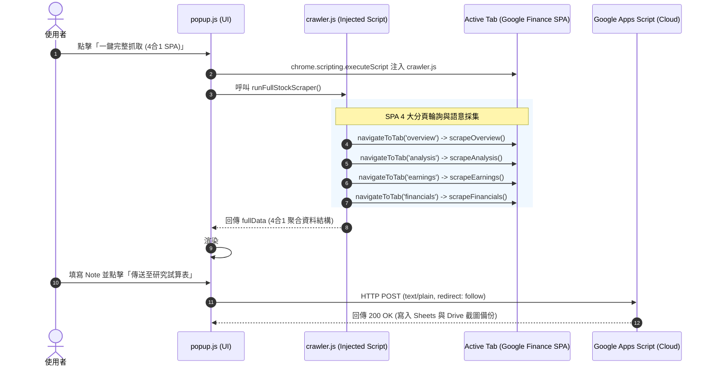

# **Finance Research Clipper 開發規格與架構說明書 (MV3)**

> **定位**：投資研究靈感擷取與自動草稿生成系統的前端採集器（Chrome Extension V3）。支援 Google Finance Beta 單頁應用 (SPA) 4合1 動態走訪爬取、AI 研究面板問答擷取、圖表截圖壓縮，並無縫同步至雲端 Google Sheets (GAS) 及本地 Markdown/CSV 導出。

---

## **1. 檔案架構與核心模組速查 (File Map)**

專案目錄：[`finance-research-clipper-oss`](../)

| 檔案路徑 | 核心職責 | 關鍵函式 / 元素 ID |
| :--- | :--- | :--- |
| [`manifest.json`](../manifest.json) | MV3 宣告、權限 (`tabs`, `sidePanel`, `storage`, `scripting`) 與 Host Permissions | `"side_panel": { "default_path": "sidepanel.html" }` |
| [`dashboard.html`](../dashboard.html)<br>[`dashboard.js`](../dashboard.js)<br>[`dashboard.css`](../dashboard.css) | **[核心] 獨立分頁儀表板**：全螢幕看板、歷史標的庫、分析師目標價、財報矩陣、損益表與導出矩陣 | `renderStock()`, `exportMarkdown()`, `exportCsv()`, `sendToGas()` |
| [`sidepanel.html`](../sidepanel.html)<br>[`sidepanel.js`](../sidepanel.js)<br>[`sidepanel.css`](../sidepanel.css) | **[快捷] Chrome 側邊欄工具箱**：常駐側邊、快捷輸入爬取、左下角工具箱跳轉按鍵組合 | `#btn-side-open-dashboard`, `#btn-side-paste-crawl`, `#btn-side-crawl-active` |
| [`crawler.js`](../crawler.js) | **[核心爬蟲]** SPA 動態走訪 4 大分頁，語意化文字定位與超時防護 | `window.FinanceCrawler`<br>`runFullStockScraper()`<br>`navigateToTab()` |
| [`popup.html`](../popup.html)<br>[`popup.js`](../popup.js) | 擴充介面結構、樣式與折疊面板，提供一鍵前往儀表板捷徑 (頂部徽章與底部主按鈕) | `#open-dashboard-btn`, `#btn-goto-dashboard`, `executeFullStockCrawler()` |
| [`background.js`](../background.js) | 背景服務工作線程：後台靜默分頁調度、數據持久化與跨視窗廣播 | `crawlStockByKeyword()`, `waitForTabLoaded()` |
| [`docs/google-apps-script.md`](./google-apps-script.md) | 雲端中繼站 GAS 後端接收腳本 (接收 POST, 寫入 Sheets & Drive) | `doPost(e)` |

---

## **2. 系統數據流向與 SPA 走訪架構 (Data Pipeline)**

### **2.1 循序架構圖**



---

## **3. 4合1 SPA 爬蟲核心規格 ([`crawler.js`](../crawler.js))**

### **3.1 分頁採集職責**

1. **Overview (總覽)**：
   - 提取 `symbol`（股票代號，自 `[data-symbol]`、`h1` 或 URL 正則）。
   - 提取 `price`（即時股價，自 `[data-last-price]` 或 `.YMlKvd`）。
   - 語意化掃描 Key Stats：市值 (`Market cap`)、本益比 (`P/E ratio`)、52週高低點、殖利率。
2. **Analysis (分析師評級)**：
   - 透過文字共識比對擷取評級：`Strong Buy` / `Buy` / `Hold` / `Underperform` / `Sell`。
   - 目標價提取：最高 (`high`)、中位數 (`median`)、最低 (`low`)。
   - 評級摘要區塊截取。
3. **Earnings (財報表現)**：
   - 提取最新季度 `epsActual` vs `epsEstimate`、`revenueActual` vs `revenueEstimate`。
   - 財報表格 (`table`) 矩陣提取。
4. **Financials (財務報表)**：
   - 提取損益表 (Income Statement) 表格與指標數據陣列。

### **3.2 韌性定位與防護機制**

- **語意文字定位 (Semantic Anchoring)**：捨棄易隨 Google 前端編譯變動的隨機混淆 Class，優先以標籤內文 (`Market cap`, `Target price`, `EPS`) 作為錨點尋找相鄰兄弟節點。
- **超時保護 (`waitForCondition`)**：單頁等待最大上限 5 秒，逾時自動降級 (Fallback) 略過該分頁，確保流程不卡死。
- **孤立世界沙盒 (Isolated World)**：腳本運行於獨立環境，無法存取主頁面 JS 物件，避免 XSS 攻擊與宿主代碼干擾。

---

## **4. 數據傳輸 Payload 結構規範**

向 Google Apps Script 發送的 JSON Payload 欄位定義：

```typescript
interface ClipperPayload {
  timestamp: string;               // ISO 8601 時間字串
  mode: "stock" | "ai";           // 抓取模式
  ticker: string;                  // 標的代號 (例如: "NVDA")
  price: string;                   // 當前股價
  sp500?: string;                  // 大盤 S&P 500 指數
  nasdaq?: string;                 // 大盤 Nasdaq 指數
  mktcap?: string;                 // 市值
  pe?: string;                     // 本益比
  analyst_consensus?: string;      // 分析師共識 (NEW: 例如 "Strong Buy")
  target_price_median?: string;    // 目標價中位數 (NEW: 例如 "$160.00")
  target_price_high?: string;      // 最高目標價 (NEW)
  target_price_low?: string;       // 最低目標價 (NEW)
  financials_table?: string[][];   // 損益表矩陣 (NEW)
  note: string;                    // 筆記 (自動附加關鍵統計與 Markdown 報表)
  screenshot?: string;             // Base64 JPEG 圖表截圖 (等比壓縮寬度 800px)
}
```

### **CORS 與請求優化策略**
- **傳輸格式**：採用 `Content-Type: text/plain;charset=utf-8` 發送，避免引發 OPTIONS 預檢請求 (Preflight)。
- **跳轉跟隨**：`fetch(url, { method: "POST", mode: "cors", redirect: "follow", body: JSON.stringify(payload) })`，妥善處理 GAS 的 302 重新導向。

---

## **5. AI 開發精準導航與常見修改路徑**

| 想修改的功能 / 需求 | 鎖定檔案與位置 | 修改指引 |
| :--- | :--- | :--- |
| **擴充或修正 Google Finance 新分頁/指標** | [`crawler.js`](../crawler.js) | 在 `runFullStockScraper()` 的 `tabs` 陣列新增分頁項目，實作對應之 `scrapeXxx()` 函式。 |
| **調整彈出視窗按鈕、預覽排版** | [`popup.html`](../popup.html)<br>[`popup.js`](../popup.js#L260-L330) | 在 `executeFullStockCrawler()` 調整 `previewHtml` 模板，注意所有文字輸出必須經過 `escapeHtml()`。 |
| **增加匯出欄位 (Markdown / CSV / GAS)** | [`popup.js`](../popup.js#L460-L640) | 在 `buildStockPayload()`、`copyMarkdownBtn` 與 `downloadCsvBtn` 事件監聽中同步擴充欄位映射。 |
| **安全檢查與合規性驗收** | 終端執行 | `npm run audit:manifests` 或 `python 1.devtools/tools/audit_manifests.py`。 |

---

## **6. 故障排除速查表 (Troubleshooting)**

| 現象 / 報錯 | 核心原因 | 快速解決路徑 |
| :--- | :--- | :--- |
| **`FinanceCrawler 未成功載入`** | `crawler.js` 未被注入或載入超時 | 檢查 [`popup.js`](../popup.js) 的 `executeScript` 是否有 `files: ['crawler.js']` 且 tabId 有效。 |
| **分頁數據顯示 N/A 或未更新** | SPA 分頁路由切換後虛擬 DOM 未水合完成 | 檢查 [`crawler.js`](../crawler.js) 的 `navigateToTab()` 等待條件與延遲微調。 |
| **`TypeError: Failed to fetch`** | GAS 部署網址錯誤或未公開 | 開啟設定面板確認 URL，確認 GAS 部署為「所有人 (Anyone) 具存取權」。 |
| **擴充按鈕呈橘/紅禁用狀態** | 當前分頁非目標路徑或缺少 API URL | 確認目前分頁為 `google.com/finance` 且設定頁已填寫 GAS Webhook。 |
