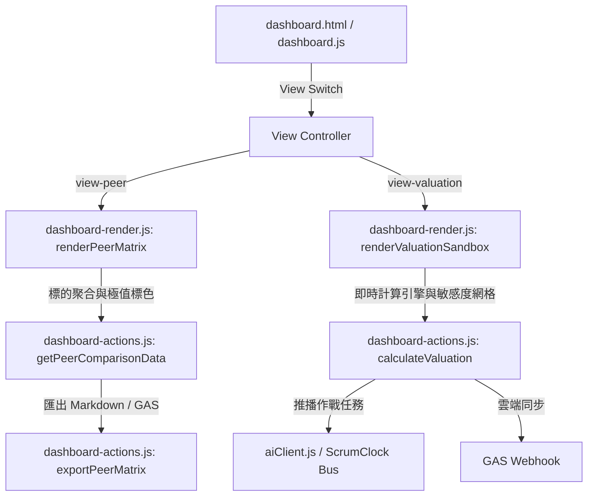

# FinanceClipper V2: 同業橫向對比矩陣與敏感度估值沙盒業務規格 (Peer Matrix & Valuation Spec)

> [!IMPORTANT]
> **SSOT 業務規格文件 (L3)**：
> 本文檔定義 `finance-research-clipper-oss` 之同業橫向對比矩陣 (Peer Comparison Matrix) 與估值情境敏感度沙盒 (Valuation Sandbox) 的核心業務邏輯、指標演算法、估值公式與跨插件接口規格。

---

## 1. 架構定位與設計原則

1. **純原生客戶端運算 (Zero-Build & Pure Client-Side)**：
   - 完全採用原生 Vanilla JS (ES6+) 與 CSS Grid/Flexbox 實作。
   - 零額外 API 請求，完全依託於 `chrome.storage.local` 中的 `stockHistory` 既有爬取資料。
2. **多載體與多視圖切換 (View Switcher)**：
   - 儀表板 (`dashboard.html`) 頂部導航列提供三向視圖切換：
     - `view-single`：既有個股詳細研報主視圖（損益表、市場專題、分析師目標價）。
     - `view-peer`：同業橫向對比矩陣（2~5 檔標的即時橫向對比與視覺化長條）。
     - `view-valuation`：敏感度估值沙盒（Bear / Base / Bull 情境、參數滑桿與 5x5 敏感度熱力矩陣）。
3. **無干擾與零破壞性**：
   - 個股單檔研究流程與同業對比/估值沙盒解耦，透過 `activeView` 狀態平滑切換，歷史自選庫與分類標籤皆無縫相容。

---

## 2. 同業橫向對比矩陣規格 (Peer Comparison Matrix)

### 2.1 標的選取與資料聚合
- **選取門檻**：支援勾選 2 至 5 檔歷史庫標的。未達 2 檔或超過 5 檔時呈現友善引導提示。
- **快取資料聚合**：由 `dashboard-actions.js` 之 `getPeerComparisonData(tickers)` 自 `stockHistory` 提取並標準化數值（市值、現價、P/E、P/S、EPS、52週高低、目標價等）。

### 2.2 橫向指標與極值計算規則
矩陣表格橫向對比包含以下欄位，並支援自動尋找極值並標註色彩徽章：
1. **現價 (Price)** 與 **漲跌幅 (Change)**。
2. **市值 (Market Cap)**：
   - 數值轉換支援 `T` (兆)、`B` (十億)、`M` (百萬)。
   - 最大市值標註「👑 龍頭 (Market Leader)」綠色徽章。
3. **本益比 (P/E Ratio - TTM)**：
   - 剔除小於等於 0 或 N/A 之異常值後，最低 P/E 標註「💎 最具性價比 (Value Pick)」綠色徽章；最高 P/E 標註「🔥 倍數最高 (Highest Premium)」橙色徽章。
4. **市銷率 (P/S Ratio)**。
5. **每股盈餘 (EPS - TTM)**：
   - 最高 EPS 標註「⚡ 獲利最強 (Top Earner)」綠色徽章。
6. **52 週區間 (52-Week Range) 與位階進度條**：
   - 計算現價位於 52 週最低與最高點之相對百分比：
     $$\text{Pos} = \frac{\text{Price} - \text{Low}_{52}}{\text{High}_{52} - \text{Low}_{52}} \times 100\%$$
   - 以視覺化 Mini Progress Bar 呈現高低點分佈與當前指針。
7. **分析師潛在上漲空間 (Upside Potential)**：
   - 最大潛在上漲空間標註「🚀 空間最大 (Max Upside)」綠色徽章。

### 2.3 視覺化長條圖比對 (Comparative Bar Charts)
在對比矩陣下方提供三項直觀水平長條比對圖（依標的數值等比例縮放寬度）：
- **市值規模對比 (Market Cap)**
- **P/E 估值倍數對比 (P/E Multiple)**
- **分析師潛在空間對比 (Upside Potential %)**

### 2.4 匯出與協同
- **一鍵複製 Markdown 表格**：產生乾淨 GitHub-Flavored Markdown 表格至剪貼簿。
- **匯出 Google Sheets (GAS)**：發送 `action: "export_peer_matrix"` 結構化 Payload 至指定 Apps Script Webhook。

---

## 3. 估值情境敏感度沙盒規格 (Valuation Sandbox)

### 3.1 核心估值模型與三種情境
以選定標的當前基準 EPS 與現價為出發點，提供三種市場情境預測卡片：
1. **保守悲觀情境 (Bear Case)**：較低成長率預期、估值倍數收縮、較高折現率。
2. **基準共識情境 (Base Case)**：貼近分析師共識預測。
3. **樂觀超預期情境 (Bull Case)**：高成長持續、倍數維持高檔或擴張。

### 3.2 互動動態參數滑桿 (Interactive Sliders)
使用者可拖曳調整三組核心參數，計算引擎即時動態連動：
1. **預估營收/EPS 年增率 (Expected Growth Rate, $g$)**：預設範圍 $-20\%$ 至 $+60\%$，預設 $+15\%$。
2. **目標出場 P/E 倍數 (Exit P/E Multiple, $PE_{\text{exit}}$)**：預設範圍 $5\times$ 至 $80\times$，預設 $25\times$。
3. **折現率 (Discount Rate / Required Return, $r$)**：預設範圍 $6\%$ 至 $20\%$，預設 $10\%$。
4. **預測年限 ($N$)**：固定為 3 年。

### 3.3 計算公式定義
1. **未來預估 EPS ($EPS_{\text{future}}$)**：
   $$EPS_{\text{future}} = EPS_{\text{base}} \times (1 + g)^N$$
2. **未來終端目標價 ($P_{\text{future}}$)**：
   $$P_{\text{future}} = EPS_{\text{future}} \times PE_{\text{exit}}$$
3. **現值目標價 (Present Value Target Price, $P_{\text{target}}$)**：
   $$P_{\text{target}} = \frac{P_{\text{future}}}{(1 + r)^N}$$
4. **潛在折現回報空間 (Upside %)**：
   $$\text{Upside} = \frac{P_{\text{target}} - P_{\text{current}}}{P_{\text{current}}} \times 100\%$$

### 3.4 5x5 成長率 vs Exit P/E 敏感度二維熱力矩陣 (Sensitivity Heatmap)
- 橫軸：5 個 Exit P/E 倍數階梯（基準倍數的 $0.6\times, 0.8\times, 1.0\times, 1.2\times, 1.4\times$）。
- 縱軸：5 個預期成長率階梯（基準成長率的 $-10\%, -5\%, \pm 0\%, +5\%, +10\%$）。
- 矩陣單元格：計算對應情境下之現值目標價與漲跌幅。
- 顏色階梯 (Heatmap Grading)：
  - 上漲 $\ge +30\%$：深綠色背景與文字
  - 上漲 $0\% \sim +30\%$：淺綠色
  - 下跌 $-20\% \sim 0\%$：淺橙色
  - 下跌 $< -20\%$：柔和淡紅色

### 3.5 跨插件推播至 ScrumClock (UniversalTaskPayload v2.3)
點擊「🎯 推播估值結論至 ScrumClock」時，自動組裝標準通訊封包：
```json
{
  "action": "CREATE_TASK",
  "task": {
    "title": "【投資研究】NVDA 估值沙盒推演與建倉規劃",
    "description": "現價 $120.00 | 基準目標價 $145.20 (+21.0%) | 樂觀 $185.00 | 悲觀 $98.00\n關鍵假設: 3年CAGR 20.0%, Exit PE 28.0x, 折現率 10.0%",
    "priority": "P1",
    "gtdContext": "@Invest",
    "sourcePlugin": "FINANCE_CLIPPER"
  }
}
```
透過 `aiClient.js` 之安全通訊管線發送，若對端休眠則自動進入 `outbox_queue` 離線保全重試佇列。

---

## 4. 模組職責與呼叫關係圖



---

## 5. 驗收與安全標準
- **無外部注入 (CSP Compliant)**：所有動態渲染內容均經過安全轉義，防範 XSS 攻擊。
- **純離線/本地優先 (Local-First)**：無外部網路時，沙盒計算與矩陣依然 100% 正常運作。
